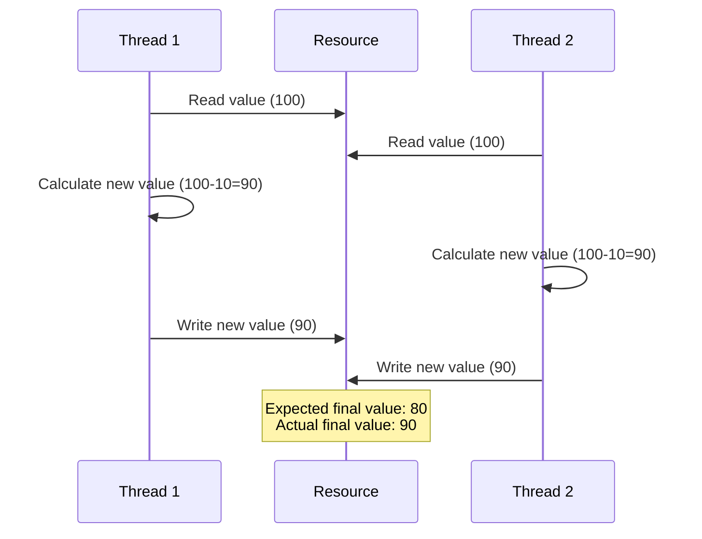
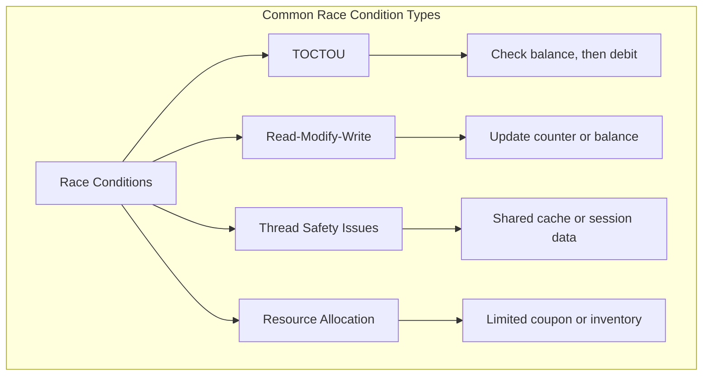
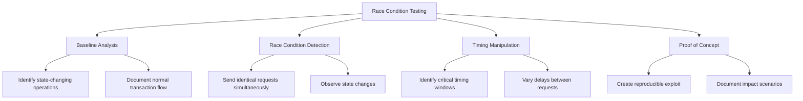
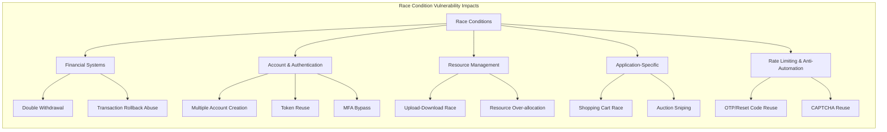
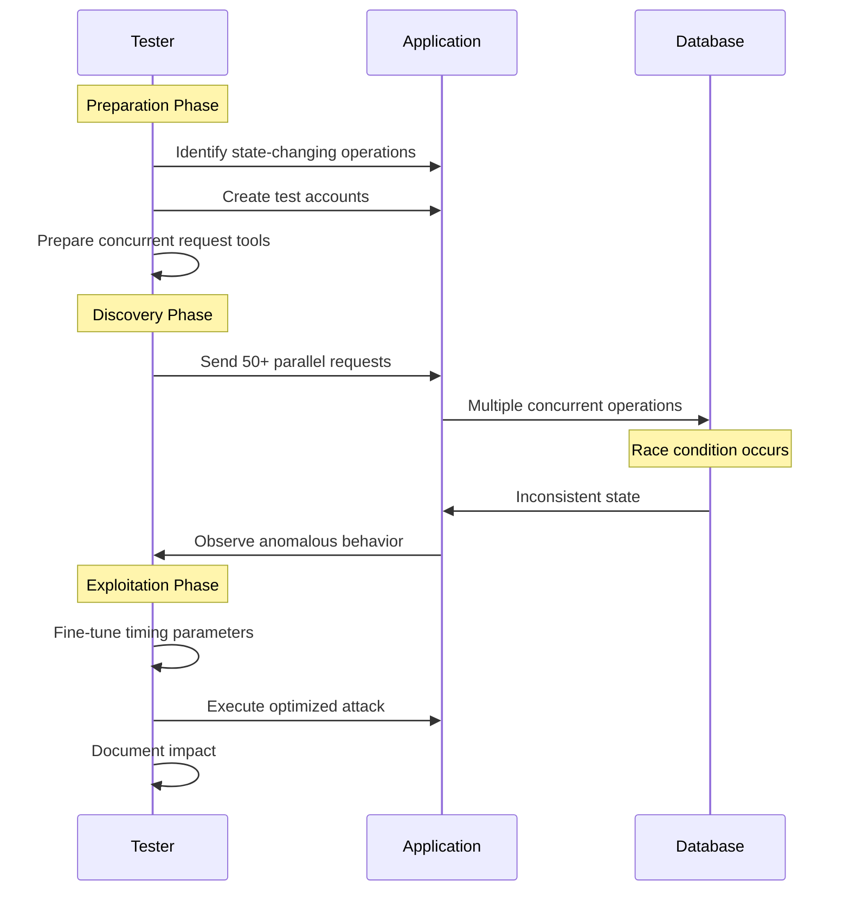

## Crown Jewel Targets

Race conditions are high-severity findings because they break financial, access control, and integrity assumptions that defenders rarely stress-test. Highest payouts come from:

- **Monetary/credit systems** — double-spending gift cards, coupons, referral bonuses, promotional credits, wallet balances
- **Vote/reputation manipulation** — upvoting the same content multiple times, gaming leaderboards or trending algorithms
- **Account limits bypass** — exceeding free-tier quotas, bypassing "one per user" restrictions on invites, trial activations, or API key generation
- **Privilege escalation** — racing role assignment or permission checks during user creation/upgrade flows
- **Deletion bypass** — reading or exfiltrating data during a narrow window between "marked for deletion" and "actually deleted"
- **Payment flows** — charging a card once but receiving multiple fulfillments

**Best-paying asset types:** Fintech apps, SaaS platforms with credit/subscription models, social platforms with reputation systems, e-commerce checkout flows, OAuth/SSO token endpoints.

---

## Attack Surface Signals

### URL Patterns
```
/vote, /upvote, /like, /favorite
/redeem, /apply-coupon, /use-code, /claim
/purchase, /checkout, /confirm-order, /pay
/transfer, /withdraw, /send-money
/invite, /referral, /accept-invite
/upgrade, /activate, /trial
/delete, /deactivate, /cancel
/follow, /subscribe
```

### Response Headers That Signal Race-Prone Backends
```
X-RateLimit-*        # rate limiting exists, but may not be atomic
X-Request-Id         # each request independently tracked
No Cache-Control     # stateful ops not idempotent
```

### JavaScript Patterns to Grep
```javascript
// Single-use action buttons with client-side disable
button.disabled = true
$('#btn').prop('disabled', true)
// Optimistic UI updates (state set before server confirms)
setState({ used: true })
// Sequential async calls without locking
await useVoucher(); await deductBalance();
```

### Tech Stack Signals
- **Ruby on Rails** without `with_lock` / `lock!` — ActiveRecord doesn't lock by default
- **Node.js** with async/await chains — non-atomic DB reads then writes
- **PHP** without `SELECT ... FOR UPDATE` — common in legacy codebases
- **Microservices** — inter-service calls introduce natural TOCTOU windows
- **Redis counters** without Lua scripts or `INCR` atomicity checks
- **Message queues** — idempotency keys often missing

---

## Step-by-Step Hunting Methodology

1. **Enumerate one-time or limited-use actions** — Map every endpoint that enforces a "once per user", "limited quantity", or "deduct balance" constraint. These are your primary targets.

2. **Understand the state machine** — For each target action, identify: (a) what state is read, (b) what state is written, (c) what validation sits between read and write. The gap between read and write is your window.

3. **Capture a clean baseline request** — Perform the action once legitimately with Burp Suite intercepting. Confirm you get the expected single-use behavior (e.g., coupon marked used, vote counted once).

4. **Set up parallel request tooling** — Use one of:
   - Burp Suite Repeater → "Send group in parallel" (Turbo Intruder for HTTP/2 single-packet attacks)
   - Turbo Intruder with `engine=Engine.BURP2` for last-byte sync
   - `curl` with `&` backgrounding
   - Python `threading` or `asyncio` with pre-built connections

5. **Execute the race** — Send 10–50 identical requests simultaneously. Key technique: **pre-connect and buffer all requests, release the final byte of all simultaneously** (single-packet attack when HTTP/2 is available).

6. **Analyze responses** — Look for:
   - Multiple `200 OK` where only one should succeed
   - Duplicate success messages
   - Database constraint errors (signals the race worked but hit the last-line-of-defense)
   - Inconsistent response times (one fast, rest slow = serialized; all same speed = parallel processing)

7. **Verify the effect** — Check the actual state: Was the credit applied twice? Did the vote count increment multiple times? Is the coupon still marked unused despite two successes?

8. **Determine exploitability window** — Re-run with decreasing parallelism (5 requests, 3 requests, 2 requests) to understand how tight the window is and reliability of exploitation.

9. **Test across account types** — Sometimes the race only works for new accounts, specific subscription tiers, or under specific server load. Test varied conditions.

10. **Document reproducibility** — Record exact timing, number of parallel requests needed, and success rate across 5 independent attempts before reporting.

---

## Payload & Detection Patterns

### Turbo Intruder — Basic Parallel Race
```python
# turbo_intruder_race.py
def queueRequests(target, wordlists):
    engine = RequestEngine(endpoint=target.endpoint,
                           concurrentConnections=1,
                           engine=Engine.BURP2)  # HTTP/2 single-packet
    for i in range(20):
        engine.queue(target.req, gate='race1')
    engine.openGate('race1')

def handleResponse(req, interesting):
    if '200' in req.status:
        table.add(req)
```

### curl — Parallel Requests (bash)
```bash
# Fire 15 simultaneous vote/redeem requests
for i in $(seq 1 15); do
  curl -s -o /dev/null -w "%{http_code}\n" \
    -X POST "https://target.com/api/vote" \
    -H "Cookie: session=YOUR_SESSION" \
    -H "Content-Type: application/json" \
    -d '{"report_id": "12345", "vote": "up"}' &
done
wait
```

### Python asyncio Race
```python
import asyncio, aiohttp

async def race_request(session, url, payload, headers):
    async with session.post(url, json=payload, headers=headers) as r:
        return await r.text()

async def main():
    url = "https://target.com/redeem"
    payload = {"code": "GIFT50"}
    headers = {"Cookie": "session=XXXXX"}
    
    async with aiohttp.ClientSession() as session:
        tasks = [race_request(session, url, payload, headers) for _ in range(20)]
        results = await asyncio.gather(*tasks)
    
    for r in results:
        print(r[:100])  # print first 100 chars of each response

asyncio.run(main())
```

### Grep Patterns for Source Code Auditing
```bash
# Look for read-then-write without locking
grep -rn "find_by\|where.*first" --include="*.rb" | grep -v "lock"
grep -rn "SELECT.*WHERE" --include="*.php" | grep -v "FOR UPDATE"

# JavaScript async without atomicity
grep -rn "await.*get\|await.*find" --include="*.js" -A2 | grep "await.*update\|await.*save"

# Python Django ORM without select_for_update
grep -rn "\.get(\|\.filter(" --include="*.py" | grep -v "select_for_update"
```

### HTTP/2 Single-Packet Check
```bash
# Verify target supports HTTP/2 (prerequisite for single-packet attack)
curl -sI --http2 https://target.com | grep -i "HTTP/2\|h2"
```

---

## Common Root Causes

1. **Check-Then-Act without atomic operations** — Developer reads state (`if voucher.used == false`), then writes state (`voucher.update(used: true)`) in two separate database operations. Any thread can read the same "unused" state before either writes.

2. **Missing database-level locking** — Using ORM methods like `find` or `filter` instead of `SELECT ... FOR UPDATE`. The fix is one line but developers don't think about concurrency.

3. **Optimistic concurrency without version checking** — Systems increment counters or mark records without checking if the record changed since it was read.

4. **Microservice TOCTOU** — Service A validates eligibility, Service B executes the action. No shared atomic transaction spans both services.

5. **Client-side "protection"** — Developers disable the button in JavaScript after first click, assuming that prevents duplicate submissions. Server-side logic is never hardened.

6. **Counter increments outside transactions** — `votes_count += 1; save()` instead of an atomic SQL `UPDATE SET votes = votes + 1 WHERE id = ?`.

7. **Async background jobs** — Eligibility checked synchronously, fulfillment done asynchronously. A second request passes the check before the first job completes.

8. **Caching without invalidation** — Cached "has user voted?" check returns stale `false` during a cache miss window when the first write hasn't propagated yet.

---

## Bypass Techniques

### What Defenders Implement (and How to Bypass)

**Defense: Per-user rate limiting**
- Bypass: Rate limits are checked before the action executes. Send requests simultaneously — all pass the rate-limit check before any is counted.

**Defense: Idempotency keys / unique request tokens**
- Bypass: If the server generates or reuses the token, try sending parallel requests without the token. Or check if the uniqueness check itself has a race window.

**Defense: Database unique constraints**
- Bypass: The constraint catches duplicates *after* the race. The first two may both succeed before DB enforces. Look for partial fulfillment — sometimes one succeeds and one errors but both are honored.

**Defense: Short time windows / expiring tokens**
- Bypass: Pre-stage all requests with valid tokens. Use single-packet HTTP/2 to release all in one TCP frame — server processes them in the same scheduler slot.

**Defense: Queue-based serialization**
- Bypass: Multiple queues (or multiple workers consuming the same queue) can pick up duplicate messages. Test by overwhelming the queue during the window.

**Defense: Application-layer mutex / locks**
- Bypass: Distributed systems running multiple app servers don't share in-process locks. Send requests to the same endpoint via different CDN nodes or load-balanced servers.

**Defense: "Already used" checks in application code**
- Bypass: The check and the update are separate. The check passes for both racing requests before either update completes. Only an atomic `UPDATE ... WHERE used=false RETURNING id` truly prevents this.

---

## Gate 0 Validation

Before writing the report, confirm all three:

1. **What can the attacker DO right now?**
   Can you demonstrate — with screenshots or logs — that the same one-time action succeeded more than once? (e.g., vote count shows +2 from one user, credit balance shows double-credit, coupon shows redeemed twice)

2. **What does the victim LOSE?**
   Is there concrete, measurable harm? Financial loss (credits issued in excess), integrity loss (manipulated rankings/votes), or security loss (access granted beyond entitlement)? "The counter went up twice" is only valid if that counter has real-world value.

3. **Can it be reproduced in 10 minutes from scratch?**
   Can you write a 20-line script, run it against a fresh test account, and reliably demonstrate the duplicate effect at least 3/5 attempts? If it requires perfect timing you cannot reliably control, the exploitability claim is weak.

---

## Real Impact Examples

### Scenario 1: Social Platform Vote Manipulation
A bug bounty platform's "popular reports" feature allowed upvotes to improve report visibility and researcher reputation scores. By sending ~15 parallel upvote requests for the same report using a single HTTP/2 connection (single-packet attack), a researcher was able to register 10–15 votes from a single account. This allowed artificial inflation of report rankings, manipulation of researcher reputation scores, and distortion of the platform's crowdsourced prioritization system — directly undermining trust in the platform's core feature for triaging vulnerability reports.

### Scenario 2: Major Social Network — Duplicate Promotional Actions
On a major social network (Facebook-scale), promotional or limited-use actions — such as adding a phone number for a one-time security credit, or claiming a one-time bonus — were vulnerable to simultaneous parallel requests. An attacker could race the claim endpoint and receive the promotional benefit multiple times, causing direct financial loss to the platform and allowing fraudulent accumulation of platform currency or benefits at scale. Given the user volume, even a brief window before patching represented significant financial exposure.

### Scenario 3: Cloud Infrastructure Provider — Resource Limit Bypass
A cloud hosting provider enforced limits on the number of resources (e.g., droplets, projects, or API keys) a free-tier user could create. The limit check and resource creation were non-atomic operations. By racing the creation endpoint with 20 simultaneous requests, an attacker bypassed the enforcement logic and created resources far exceeding their tier limit. This translated directly to unauthorized compute consumption, billing fraud, and abuse of infrastructure — impacting both the provider's revenue and system stability for legitimate users.

---

## Disclosed Report Citations (Backfill +9 — 2016-2024)

The following real, verified bug-bounty / coordinated-disclosure cases extend this skill. Four cases (#4, #11, #12, plus the bonus reference) use the modern **HTTP/2 single-packet attack** technique (Kettle DEF CON 31, 2023; Flatt Security expansion 2024) — the technique that makes most modern race exploits viable today.

4. **GitLab — CVE-2022-4037 email-verification race (Kettle DEF CON 31 case study)** ([NVD](https://nvd.nist.gov/vuln/detail/CVE-2022-4037) · [PortSwigger Research](https://portswigger.net/research/smashing-the-state-machine))
    - Subclass: password-reset / email-change token race (TOCTOU on email verification)
    - Single-packet HTTP/2: **YES** — flagship case study in "Smashing the State Machine"
    - Payload: two concurrent `POST /-/profile` requests changing email to two different addresses; the verification token sent to address A becomes valid for address B because state transitions weren't atomic
    - Root cause: Devise (Rails auth) builds the confirmation token before the new email is persisted; concurrent updates misroute the token
    - Year: 2022 (disclosed 2023), CVSS 6.4, patched 15.7.2 / 15.6.4 / 15.5.7

5. **Worldcoin (Tools for Humanity) — World ID action-verification race** ([Medium writeup](https://medium.com/@gonzo-hacks/the-fast-and-the-curious-finding-a-race-condition-in-worldcoin-621c89bfbd61))
    - Subclass: vote/upvote inflation (one-human-one-action enforcement bypass)
    - Payload: ~20 parallel requests via Burp "Send in Parallel" against the verification endpoint
    - Root cause: `canVerifyForAction` appended to an array without DB-level locking; fix added `nullifiers` table with atomic UPSERT
    - Year: 2023 — **$3,000** (High)

6. **Stripe — Promotion code redeemed past limit** ([H1 #1717650](https://hackerone.com/reports/1717650))
    - Subclass: coupon double-redemption
    - Payload: create promo with redemption limit = 1; open two payment-link tabs of same merchant, apply coupon in both, click Pay simultaneously → both succeed
    - Root cause: redemption counter incremented post-charge, not atomically with charge; no row-level lock on `promotion_code.times_redeemed`
    - Year: 2022 — **$250**

7. **Stripe — Fee discounts redeemed many times** ([H1 #1849626](https://hackerone.com/reports/1849626))
    - Subclass: wallet/balance double-spend (Connect fee discount could be redeemed repeatedly)
    - Payload: parallel POSTs to redemption endpoint of a one-shot promotional credit before the credit-consumed flag flipped
    - Root cause: non-atomic check-then-decrement on the credit balance object
    - Year: 2023 — **$5,000**, ~$600 platform fee loss per redemption

8. **Reverb.com — Gift card multi-redemption** ([H1 #759247](https://hackerone.com/reports/759247))
    - Subclass: coupon double-redemption (gift card)
    - Payload: capture `POST /gift_cards/redeem` → duplicate N× → fire parallel → balance credited N× from a single card
    - Root cause: gift-card consumption marker written after balance credit, no `SELECT…FOR UPDATE` around the redemption read
    - Year: 2019 — **$1,500** (foundational/widely cited)

9. **Cosmos / Starport faucet — Double-mint race** ([H1 #1438052](https://hackerone.com/reports/1438052))
    - Subclass: wallet/balance double-spend (crypto faucet token issuance)
    - Payload: simultaneous `/faucet/transfer` requests; the `Transfer` Go function executes two state-mutating actions per request, both non-atomic
    - Root cause: faucet handler did not lock per-recipient; transfer() read-modify-write was not serialized
    - Year: 2022 — **$5,000** (CVSS 9.3)

10. **InnoGames — Email-activation race → unlimited diamonds** ([H1 #509629](https://hackerone.com/reports/509629))
    - Subclass: referral abuse multiplier / account-create race (one activation token → multiple "first activation bonus" payouts)
    - Payload: race the email-activation endpoint with the same one-time token before `token_used` flag committed → reward granted on every winning request
    - Root cause: token-consumption flag set in same transaction as reward grant, but transaction isolation level too low (READ COMMITTED)
    - Year: 2019 — **$2,000**

11. **RyotaK / Flatt Security — "First Sequence Sync" PIN-bruteforce (10,000-req single-packet expansion)** ([Flatt Security Research](https://flatt.tech/research/posts/beyond-the-limit-expanding-single-packet-race-condition-with-first-sequence-sync/))
    - Subclass: rate-limit bypass via race / MFA-OTP-validate race (6-digit PIN with 5-attempt cap)
    - Single-packet HTTP/2: **YES** — extends Kettle's single-packet from ~30 requests to 10,000 requests in 166 ms by splitting across IP fragments with synchronized TCP first-sequence
    - Payload: ~10,000 concurrent `POST /verify-pin` requests in 166 ms, each with a different 4-6 digit guess, all landing inside the rate-limit window
    - Root cause: rate-limit counter incremented per-request asynchronously; "5 attempts" gate read stale counter for the entire batch
    - Year: 2024 — **must-reference modern single-packet example**

12. **nopCommerce — CVE-2024-58248 gift-card double-redemption** ([NVD](https://nvd.nist.gov/vuln/detail/CVE-2024-58248))
    - Subclass: coupon double-redemption (e-commerce checkout TOCTOU)
    - Single-packet HTTP/2: **YES** — single-packet attack reproduces it reliably
    - Payload: two parallel `POST /checkout/PlaceOrder` requests both applying the same gift card → both orders complete, gift card balance debited once
    - Root cause: order-placement code path did not implement locking on gift-card balance row → check-then-debit non-atomic
    - Year: 2024 (versions before 4.80.0)

---

## HTTP/2 Single-Packet Attack — Deep Reference

The single-packet attack is the most important race-condition technique published since 2020. It collapses the race window from "tens of milliseconds with TCP-handshake jitter" to "the time the server's worker pool takes to dispatch N pre-buffered requests" — typically **under 1 ms** for the entire batch. This is what makes modern race exploits viable against rate-limited, distributed, load-balanced backends that previously seemed un-race-able.

Original research: **James Kettle, PortSwigger — "Smashing the State Machine" (DEF CON 31, August 2023)** [portswigger.net/research/smashing-the-state-machine](https://portswigger.net/research/smashing-the-state-machine). 2024 extension: **RyotaK / Flatt Security — "Beyond the Limit: Expanding Single-Packet Race Condition with First Sequence Sync"** [flatt.tech/research/posts/beyond-the-limit-expanding-single-packet-race-condition-with-first-sequence-sync/](https://flatt.tech/research/posts/beyond-the-limit-expanding-single-packet-race-condition-with-first-sequence-sync/).

### Why it works — architecture

A race exploit fails for two reasons that look like the same problem but aren't:
1. **Network jitter** — N requests sent sequentially over the same TCP connection arrive at the server with 0.5–5 ms spread, depending on RTT and congestion.
2. **Server-side dispatch ordering** — even if all N requests arrive in the same millisecond, the worker pool may serialise them via a load balancer or accept-queue.

The single-packet attack solves (1) by exploiting two protocol-level facts about HTTP/2:

- HTTP/2 multiplexes N requests over ONE TCP connection as ONE TLS record per request batch.
- TLS records can carry multiple HTTP/2 `HEADERS` frames, and each HEADERS frame can be the last frame of a separate stream.

So if you pre-stage N requests on a single HTTP/2 connection — **send all the HEADERS frames except the very last byte of each, then release all the final bytes in a single TCP write** — the TCP stack ships them in **one IP packet** (assuming < MTU, ~1500 bytes). The server's kernel hands all N requests to the HTTP/2 parser in the same scheduler tick. The race window is no longer the network — it's the application's own atomicity-failure window.

For (2) — server-side dispatch ordering — Kettle showed that modern backends (Node.js, Go, async Python) dispatch concurrently within microseconds when handed a packet of N pre-parsed requests. Older blocking backends (default Apache prefork, single-threaded PHP-FPM) serialise even with single-packet delivery; for those, the technique helps less but still wins over TCP-stream sequencing.

### Last-byte-sync technique

The exact mechanic Kettle documented:

1. Open one HTTP/2 connection. Negotiate TLS, send the SETTINGS frame, accept the server's.
2. For each of N requests, send its `HEADERS` frame **with the END_HEADERS flag** and a `DATA` frame containing **all but the last byte of the body**. Do NOT set END_STREAM yet.
3. The server cannot dispatch the request because END_STREAM hasn't fired — it's waiting for one more byte.
4. Repeat (2) for all N requests on the same connection. Each is now buffered at the server, parsed up to "almost done".
5. **In a single TCP write, send N tiny `DATA` frames each carrying 1 byte with END_STREAM set.** TCP coalesces them into one outbound segment. The server's HTTP/2 parser sees END_STREAM on all N streams in the same scheduler tick.
6. Server dispatches N requests to N workers in microseconds.

The race window equals the time between worker N's `SELECT ... FOR UPDATE` and worker N+1's same query — typically nanoseconds when the workers run on the same CPU.

### Wireshark validation

To confirm your attack tool is genuinely producing one-packet sync (vs accidentally fragmenting):

1. Capture the loopback or your egress interface during the attack: `sudo tcpdump -i lo0 -w race.pcap port 443` (or interface 0).
2. Open in Wireshark, filter `tls and tcp.port == 443`.
3. Find the TLS record containing the END_STREAM flush. It should contain **N H2 DATA frames with END_STREAM set, in one TLS record, in one TCP segment.**
4. If you see N TLS records or N TCP segments, your tool is sequencing. The race window is your inter-segment gap — typically too wide.

The Turbo Intruder `engine=Engine.BURP2` implementation guarantees single-packet delivery on HTTP/2 targets when the request body fits in MTU. For larger bodies, see the "Race-window estimation" subsection below.

### h2.0 single-frame vs h2.cl multi-frame race

Two variants depending on what protocol the target speaks:

- **h2.0 single-frame** (the standard Kettle attack): pure HTTP/2 end-to-end. N requests in one TLS record. Works against any modern HTTPS-fronted target where the front-end advertises `h2` in ALPN. **Default approach.**
- **h2.cl multi-frame**: front-end speaks HTTP/2 to the client, downgrades to HTTP/1.1 to the back-end. Smuggling-adjacent — you craft an HTTP/2 request whose `Content-Length` confuses the front-end into emitting two HTTP/1.1 requests to the back-end on the same connection. Pairs with HTTP request smuggling (see `hunt-http-smuggling`). Useful when single-packet HTTP/2 is filtered at the front-end but the back-end is reachable in HTTP/1.1.

Detect h2.0 viability via `curl -sI --http2 https://target.com | grep -i HTTP/2`. If the server doesn't speak h2, single-packet is not directly applicable — fall back to "parallel-pipelining" over HTTP/1.1 (much wider race window; usually loses the race against modern backends, but still useful for naive ones).

### Race-window estimation methodology

Before firing the attack, estimate the race window. This determines whether you need single-packet at all, and how many concurrent requests to send.

1. Issue a **single** request to the target endpoint. Capture the response time on the wire: `T_single`.
2. Issue **two sequential** requests. Capture both response times: `T_seq1`, `T_seq2`.
3. Issue **two concurrent** requests over the same connection (via HTTP/2 multiplex or HTTP/1.1 pipeline). Capture both: `T_par1`, `T_par2`.
4. If `T_par1 ≈ T_par2 ≈ T_single`, the server handles both in parallel — race window is `min(T_par1, T_par2)`, single-packet helps a lot.
5. If `T_par2 ≈ T_par1 + T_single`, the server serialises — race window is whatever happens between sequential workers; single-packet helps less but still wins over TCP jitter.
6. For PIN / OTP / coupon-redemption endpoints, expect `T_single` to be 10–100 ms (DB query latency). The race window inside the server is typically < 1 ms (the gap between `SELECT` and `UPDATE` on the same row).
7. **N rule of thumb:** start with `N = 30` concurrent requests for single-packet h2. Increase to 100+ if the target's `T_single` is < 10 ms (very fast endpoint = larger pre-buffer needed to overflow the worker pool). Up to **10,000** with Flatt's first-sequence-sync extension (see below).

### Single-connection-multi-stream vs Multi-connection-single-stream

A decision tree for picking the right shape:

- **Single connection, N streams** (default Kettle / Turbo Intruder BURP2 engine): N concurrent HTTP/2 streams on one TCP connection. **Use when:** target speaks HTTP/2; request body fits in MTU (~1400 bytes after TLS overhead); you need N ≤ ~30.
- **Multiple connections, one stream each** (older parallel HTTP/1.1): N TCP connections, one request per connection. **Use when:** target doesn't speak HTTP/2 OR the request body is large (> MTU). Race window widens significantly (5–50 ms TCP-handshake spread) — only viable on slow servers.
- **Multiple connections, multiple streams** (Flatt's first-sequence-sync, 2024): N TCP connections each carrying M streams. Total = N×M requests. Uses synchronized TCP first-sequence numbers across multiple connections to land all packets at the server in the same processing window. **Use when:** you need N > 30 (e.g., brute-forcing a 6-digit PIN within a 5-attempt rate-limit window — Flatt demonstrated 10,000 requests in 166 ms by splitting across IP fragments with synchronized SEQ numbers).

### Turbo Intruder `Engine.BURP2` template — explained

```python
def queueRequests(target, wordlists):
    # 1. Engine.BURP2 = HTTP/2 single-packet engine; provides the last-byte-sync primitive.
    engine = RequestEngine(
        endpoint=target.endpoint,
        concurrentConnections=1,          # 2. One TCP connection, multiplexing all streams.
        requestsPerConnection=100,        # 3. Up to 100 concurrent H2 streams. >30 needs Flatt-extension.
        engine=Engine.BURP2,              # 4. THE critical line — selects the single-packet engine.
        pipeline=False,                   # 5. Pipelining is for HTTP/1.1; irrelevant on H2.
    )

    # 6. Build N requests. Each is identical here — racing the same endpoint.
    #    For PIN brute-force, vary the body across requests.
    for i in range(30):
        engine.queue(target.req)

    # 7. openGate(...).complete(...) is the API call that performs last-byte-sync:
    #    - Buffer all 30 requests up to "last byte not sent"
    #    - Release all final bytes in a single TCP write
    #    - openGate returns immediately; complete waits for all responses.
    engine.openGate("race1")
    engine.complete(timeout=10)
```

The `Engine.BURP2` import does the heavy lifting. Behind the scenes:
- Each `engine.queue(req)` adds a HEADERS frame to the connection's send buffer but withholds the last DATA frame byte.
- `openGate("race1")` blocks until all 30 are buffered, then issues a single `socket.send(...)` containing 30 × 1-byte DATA frames with END_STREAM. All 30 cross the wire in one IP packet (assuming < MTU).
- `complete(timeout=10)` collects responses and times.

Inspect each response object: `req.code`, `req.length`, `req.time`. The race is "won" when at least 2 requests return a success that should logically have been mutually exclusive (e.g., both coupon-applies succeed when the redemption limit was 1).

### Flatt's first-sequence-sync extension (when N > 30 is needed)

Kettle's original single-packet caps at roughly N=30 due to MTU + TLS record limits. Flatt Security's RyotaK published the extension in August 2024:

- Take advantage of IP fragmentation: a single "logical" packet at the IP layer can be split across multiple physical IP fragments.
- Force synchronized TCP SEQ numbers across multiple connections by completing the TLS handshakes in lockstep and aligning the SYN/SYN-ACK timing.
- Result: 10,000 concurrent requests delivered to the server in 166 ms, all landing inside a rate-limit window that the server thought was atomic.

Use case: brute-forcing 6-digit PINs (max 10^6 candidates) inside a 5-attempts-per-window cap. Without first-sequence-sync, you'd need ~200,000 windows. With it, ~100 windows.

Implementation: [flatt.tech/research/posts/beyond-the-limit-...](https://flatt.tech/research/posts/beyond-the-limit-expanding-single-packet-race-condition-with-first-sequence-sync/) includes a working PoC.

### Operator playbook (when to reach for what)

| Scenario | Tool / variant |
|---|---|
| Modern HTTPS target, ALPN advertises `h2`, body < 1400 bytes, need N ≤ 30 | Turbo Intruder `Engine.BURP2` single-packet — **default** |
| Same as above but body > MTU | Multi-connection HTTP/2; widen window estimate by ~5 ms |
| Target speaks HTTP/1.1 only (no h2 ALPN) | `curl --next` parallel pipeline; race window is wide; only viable on slow servers |
| Need N > 30 (PIN brute-force, OTP exhaustion within rate-limit window) | Flatt first-sequence-sync extension; manual implementation per the writeup |
| Front-end h2, back-end h1 (CDN+origin) | h2.cl smuggling variant — pairs with `hunt-http-smuggling` |
| Quick reproducibility test on a single endpoint | `curl --next --next --next --next` (4-shot parallel HTTP/1.1) — wide window but no setup |

### Anti-patterns

- **Don't claim "race condition" from observing two near-simultaneous successes in Burp Repeater "Send group in parallel" mode** — that mode pipelines over HTTP/1.1 with millisecond-spread, not single-packet. Triagers know this and downgrade.
- **Don't submit without Wireshark confirmation** for high-value race claims. The deliverable that pays best: PoC video showing Turbo Intruder firing + Wireshark capture showing all N END_STREAM frames in one TCP segment + N successful responses that should have been mutually exclusive.
- **Don't use single-packet against endpoints that genuinely don't race** (e.g., endpoints with row-level locks and transactions). The window estimation step exists to filter these out before you spend 2 hours building the PoC.

### Cross-references

- `hunt-http-smuggling` — h2.cl multi-frame variant
- `hunt-mfa-bypass` — OTP rate-limit window single-packet bypass (Flatt PIN-bruteforce class)
- `hunt-business-logic` — coupon / wallet / promo state-machine races where single-packet is the enabling primitive
- Disclosed Report Citations above — citations #4, #11, #12 are the canonical single-packet exemplars (GitLab/Devise CVE-2022-4037, Flatt 10k-req PIN brute-force, nopCommerce CVE-2024-58248)

---

## Related Skills & Chains

- **`hunt-business-logic`** — Race conditions are the "concurrency arm" of every business-logic state machine. Chain primitive: business logic (coupon/promo) + race-condition single-packet attack → coupon redeemed N times → direct financial loss.
- **`hunt-mfa-bypass`** — OTP-expiry windows and replay protection are classic race targets. Chain primitive: race + MFA-validate endpoint → bypass OTP expiry by submitting N concurrent validations within the validity window.
- **`hunt-ato`** — Race conditions on password reset, email change, and account creation enable persistent ATO. Chain primitive: race on email-change endpoint + atomic-update missing → swap victim email + read reset token before user notice.
- **`hunt-api-misconfig`** — Wallet/balance/credit endpoints without atomic UPDATE are double-spend candidates. Chain primitive: race + atomic-update missing → double-spend balance → withdraw N× user balance.
- **`security-arsenal`** — Load the Turbo Intruder single-packet template, h2.cl smuggling for atomic submit, and `curl --next` parallel multi-request patterns.
- **`triage-validation`** — Apply the Statistical-Sampling gate: a single anomalous response is noise; require 1 successful + N duplicate / over-quota / stale-state demonstrations with response screenshots before reporting.

---

# Additional Techniques (merged from offensive-race-condition/SKILL.md)

## Metadata
- **Skill Name**: race-condition
- **Folder**: offensive-race-condition
- **Source**: https://github.com/SnailSploit/offensive-checklist/blob/main/race-condition.md

## Description
Race condition (TOCTOU) testing checklist: identifying timing windows, Burp Suite Turbo Intruder, Last-Byte sync technique, rate limit bypass, double-spend attacks, and concurrent request exploitation. Use for web app race condition testing or bug bounty time-of-check-to-time-of-use bugs.

## Trigger Phrases
Use this skill when the conversation involves any of:
`race condition, TOCTOU, timing attack, Turbo Intruder, last-byte sync, rate limit bypass, double spend, concurrent request, race window, time of check, time of use`

## Instructions for Claude

When this skill is active:
1. Load and apply the full methodology below as your operational checklist
2. Follow steps in order unless the user specifies otherwise
3. For each technique, consider applicability to the current target/context
4. Track which checklist items have been completed
5. Suggest next steps based on findings

---

## Shortcut

- Spot the features prone to race conditions in the target application and copy the corresponding requests.
- Send multiple of these critical requests to the server simultaneously. You should craft requests that should be allowed once but not allowed multiple times.
- Check the results to see if your attack has succeeded. And try to execute the attack multiple times to maximize the chance of success.
- Consider the impact of the race condition you just found.

## Mechanisms

Race conditions occur when the behavior of a system depends on the relative timing or sequence of events that can happen in different orders. In web application security, race conditions happen when multiple concurrent processes or threads access and manipulate the same resource simultaneously without proper synchronization.



A race condition becomes a security vulnerability when it affects security controls or business logic. The critical types include:

- Time-of-Check to Time-of-Use (TOCTOU): When a check is performed, but circumstances change before the result of the check is used
- Read-Modify-Write: When multiple processes read, modify, and write back a shared resource without coordination
- Thread Safety Issues: When multithreaded applications improperly handle shared resources
- Resource Allocation Races: Competition for limited resources like database connections or memory



Common vulnerable scenarios include:

- Account Balance Manipulation: Making multiple withdrawals/transfers simultaneously
- Coupon/Promotion Code Reuse: Using a single-use code multiple times
- File Upload Processing: Uploading and accessing temporary files before validation completes
- Registration Processes: Creating multiple accounts with the same unique identifier
- Token Verification: Using authentication tokens multiple times before they're invalidated

### Identifying Race Condition Vulnerabilities

#### Target Functionality Selection

Focus on features handling state changes, limited resources, or critical operations:

- Financial Transactions: Fund transfers, withdrawals, purchases
- Inventory Systems: Stock allocation, reservation systems
- Coupon/Points Systems: Redeeming coupons, points, or rewards
- Voting/Rating Systems: Likes, upvotes, downvotes, polls
- Membership/Subscription Actions: Inviting users, joining/leaving groups, following/unfollowing users
- Registration Systems: Account creation with unique attributes
- Resource Management: Uploading, processing, or accessing resources
- Rate-Limited Actions: Password resets, login attempts, API endpoints with usage limits

#### Testing Prerequisites

1. Tools for sending parallel requests:
   - Burp Suite Turbo Intruder or Repeater (multi-threaded)
   - Custom scripts with threading capabilities
   - Race condition testing frameworks (e.g., Racepwn)

2. Request capturing and analysis capabilities:
   - HTTP proxy for intercepting and modifying traffic
   - Response analysis tools for detecting race-related anomalies

3. Network Proximity: Consider the physical or network location of your testing infrastructure relative to the target server. Minimizing latency (e.g., using a VPS in the same region/provider as the target) can significantly increase the chances of winning a race condition.

#### Testing Methodology



1. Baseline Behavior Analysis:
   - Identify state-changing operations
   - Understand normal request/response patterns
   - Document application's standard transaction flow

2. Race Condition Detection:
   - Send identical requests simultaneously (10-100 threads)
   - Observe effects on application state
   - Look for anomalies in responses or state changes

3. Timing Manipulation:
   - Identify critical timing windows
   - Target synchronization points
   - Test with varying delays between requests

### Advanced Testing Techniques

#### API-Based Race Condition Testing

1. Identify stateful API endpoints
2. Create automated scripts for parallel API requests:

```python
import requests
import threading

def make_request():
    requests.post('https://target.com/api/redeem',
                  json={'coupon_code': 'ONCE123'},
                  headers={'Authorization': 'Bearer token'})

threads = []
for _ in range(20):
    t = threading.Thread(target=make_request)
    threads.append(t)
    t.start()

for t in threads:
    t.join()
```

#### Transaction-Based Race Condition Testing

1. Identify multi-step transactions
2. Find the critical state change requests
3. Execute the final step in parallel before state updates propagate:
   ```
   Step 1: Start purchase (single request)
   Step 2: Apply coupon (single request)
   Step 3: Send 20 simultaneous "confirm order" requests
   ```

#### Thread Synchronization Testing

Create coordinated attacks that target specific timing windows:

```python
import requests
import threading
import time

start_gate = threading.Event()

def synchronized_request():
    start_gate.wait()  # All threads wait here until flag is set
    requests.post('https://target.com/api/withdraw',
                  json={'amount': '100'},
                  headers={'Authorization': 'Bearer token'})

threads = []
for _ in range(50):
    t = threading.Thread(target=synchronized_request)
    t.daemon = True
    threads.append(t)
    t.start()

# Release all threads simultaneously
time.sleep(2)  # Ensure all threads are waiting
start_gate.set()
```

#### Network-Level Timing Manipulation

Beyond application-level threading, manipulating network-level timing can be effective:

- **HTTP/2 / HTTP/3 Single-Packet & Last-Byte-Sync Techniques**: Classic HTTP/1.1 pipelining is disabled on most servers. Modern testers rely on HTTP/2 multiplexing or HTTP/3 streams to achieve micro-second concurrency. Burp Repeater (2023.9+) and Turbo Intruder expose this as _Send group in parallel (single-packet attack)_.
- **Last-Byte-Sync / Request Splitting**: Open multiple connections, send almost-complete requests, then flush the final bytes simultaneously. In Burp, send each tab using the _single packet attack_ gate; or in Turbo Intruder:

```python
def queueRequests(target, wordlists):
    engine = RequestEngine(
        endpoint=target.endpoint,
        concurrentConnections=1,
        engine=Engine.BURP2)

    for _ in range(20):
        engine.queue(target.req, gate='race')

    engine.openGate('race')
```

#### Rate-Limiter and CAPTCHA Races

- Send concurrent login or OTP requests across multiple sessions/IPs to probe shared counters.
- Look for global vs per-user vs per-IP buckets; test burst vs sustained patterns.

### Common Race Condition Vulnerability Patterns



#### Financial Systems Vulnerabilities

- Double Withdrawal: Processing the same withdrawal request twice
- Transaction Rollback Abuse: Initiating a transaction rollback while completing the transaction
- Balance Check Bypass: Racing between balance verification and transaction processing

#### Account and Authentication Vulnerabilities

- Multiple Account Creation: Creating accounts with the same unique identifier
- Token Reuse: Using one-time tokens multiple times
- Session Fixation Race: Racing between session creation and authentication
- MFA Bypass: Racing between MFA checks and authenticated resource access

#### Resource Management Vulnerabilities

- Upload-Download Race: Accessing uploaded files before security checks complete
- Resource Allocation Race: Over-allocating limited resources
- Temporary File Races: Operating on temporary files during processing

#### Specific Application Patterns

- Shopping Cart Race Conditions: Adding items at specific discount windows
- Auction Sniping Race: Timing bids to bypass minimum increments
- Reservation System Races: Double-booking limited inventory

### Time-Sensitive Vulnerabilities

1. Send parallel password reset requests for the same account
2. Check if reset tokens are identical
3. Test by changing victim's username in one request
4. Analyze response times for potential race conditions

### Session Handling Bypass

Some application frameworks (like PHP with default session handling) lock session files when `session_start()` is called, preventing concurrent requests from the _same_ session from executing simultaneously. If the application allows a user to have multiple active sessions, this can be bypassed:

1.  Authenticate multiple times to obtain several valid session identifiers (e.g., `PHPSESSID`).
2.  Assign a unique session ID to each concurrent request in your race condition attack. This makes the server treat each request as originating from a different session, circumventing the session lock.

### Database Isolation Level Testing

Different database isolation levels handle concurrency differently. Test each level to identify race vulnerabilities:

**PostgreSQL Isolation Levels:**

```sql
-- READ UNCOMMITTED (treats as READ COMMITTED in PostgreSQL)
BEGIN TRANSACTION ISOLATION LEVEL READ UNCOMMITTED;

-- READ COMMITTED (default) - prone to races
BEGIN TRANSACTION ISOLATION LEVEL READ COMMITTED;
SELECT balance FROM accounts WHERE id = 123;
-- Race window here
UPDATE accounts SET balance = balance - 100 WHERE id = 123;
COMMIT;

-- REPEATABLE READ - prevents some races
BEGIN TRANSACTION ISOLATION LEVEL REPEATABLE READ;

-- SERIALIZABLE - strongest protection
BEGIN TRANSACTION ISOLATION LEVEL SERIALIZABLE;
```

**Testing Strategy:**

1. Identify critical transactions in the application
2. Send concurrent requests during the transaction window
3. Check if inconsistent state occurs
4. Test with explicit table locking:
   ```sql
   SELECT * FROM table FOR UPDATE;  -- Row-level lock
   LOCK TABLE table IN EXCLUSIVE MODE;  -- Table-level lock
   ```

**MySQL/MariaDB:**

```sql
-- Test for missing row locks
START TRANSACTION;
SELECT balance FROM accounts WHERE id = 123;
-- Send parallel transactions here
UPDATE accounts SET balance = balance - 100 WHERE id = 123;
COMMIT;

-- Test with explicit locking
SELECT * FROM accounts WHERE id = 123 FOR UPDATE;
```

**Testing for Advisory Locks:**

```sql
-- PostgreSQL advisory locks
SELECT pg_try_advisory_lock(12345);

-- Test if application uses them
-- Send parallel requests and monitor pg_locks table
SELECT * FROM pg_locks WHERE locktype = 'advisory';
```

### WebSocket Race Conditions

WebSocket connections maintain persistent state and can be vulnerable to race conditions:

**Message Processing Races:**

```javascript
// Send concurrent WebSocket messages
const ws = new WebSocket("wss://target.com/socket");

ws.onopen = () => {
  // Send multiple messages rapidly
  for (let i = 0; i < 50; i++) {
    ws.send(
      JSON.stringify({
        action: "transfer",
        amount: 100,
        to: "attacker",
      }),
    );
  }
};
```

**Connection Upgrade Races:**

```bash

# Multiple simultaneous WebSocket handshakes
for i in {1..20}; do
  curl -i -N \
    -H "Connection: Upgrade" \
    -H "Upgrade: websocket" \
    -H "Sec-WebSocket-Key: SGVsbG8sIHdvcmxkIQ==" \
    -H "Sec-WebSocket-Version: 13" \
    https://target.com/socket &
done
wait
```

**Testing Scenarios:**

- Concurrent authentication messages
- Simultaneous room/channel joins
- Parallel state-changing commands
- Race between disconnect and final message processing

### Cloud & Serverless Race Conditions

#### AWS Lambda Specific

**Concurrent Execution Testing:**

```python
import boto3
import concurrent.futures

lambda_client = boto3.client('lambda')

def invoke_lambda():
    return lambda_client.invoke(
        FunctionName='vulnerable-function',
        InvocationType='RequestResponse',
        Payload='{"action": "redeem_coupon", "code": "SAVE50"}'
    )

# Test concurrent invocations
with concurrent.futures.ThreadPoolExecutor(max_workers=50) as executor:
    futures = [executor.submit(invoke_lambda) for _ in range(50)]
    results = [f.result() for f in futures]
```

**Reserved Concurrency Bypass:**

- Check if Lambda has reserved concurrency limits
- Test if multiple accounts/regions bypass limits
- Monitor CloudWatch for ConcurrentExecutions metric

**DynamoDB Conditional Write Testing:**

```python
import boto3
from boto3.dynamodb.conditions import Attr

dynamodb = boto3.resource('dynamodb')
table = dynamodb.Table('coupons')

# Test if conditional writes are used
def redeem_coupon():
    table.update_item(
        Key={'code': 'SAVE50'},
        UpdateExpression='SET used = :val',
        ConditionExpression=Attr('used').eq(False),  # Should prevent races
        ExpressionAttributeValues={':val': True}
    )
```

#### GCP Cloud Functions

**Concurrent Trigger Testing:**

```bash

# Test HTTP-triggered Cloud Functions
for i in {1..50}; do
  curl -X POST https://region-project.cloudfunctions.net/function \
    -H "Content-Type: application/json" \
    -d '{"action": "claim_reward"}' &
done
wait
```

#### Azure Functions

**Singleton Testing:**

```csharp
// Check if Azure Functions use Singleton attribute
[Singleton] // Should prevent concurrent execution
public static void Run([QueueTrigger("queue")] string msg) { }
```

### Protocol-specific attack primitives

- **Single-Packet Attack (HTTP/2)** and **Last-Byte-Sync (HTTP/1)** research (PortSwigger Black Hat 2023) enables ≤ 4 µs request skew; both are now directly supported in Burp Repeater and Turbo Intruder.

### GraphQL & gRPC considerations

- GraphQL batch mutations can bypass conventional CSRF and rate-limit controls. Replay a single POST body containing 20 identical mutations to test for duplicated state changes.
- For gRPC, open multiple concurrent `SendMsg` frames before the backend commits state.

### Cloud & serverless concurrency

- Serverless functions (AWS Lambda, GCP Cloud Run, Azure Functions) may process the same event in parallel. Mitigate with idempotency keys or reserved-concurrency settings.

### Observability & detection

- Enable distributed tracing (OpenTelemetry, Jaeger) and emit duplicate-call metrics within the same trace span to surface race-condition symptoms.

### Modern defensive patterns

- Use atomic **UPSERT / ON CONFLICT** statements for write-once semantics.
- Implement **Idempotency-Key** headers (IETF draft 2024) with short-TTL storage.
- Employ Redis/etcd Redlock or PostgreSQL advisory locks for cross-service resource locking.

### Additional resources

- PortSwigger white-paper _Smashing the State Machine_ + labs (Black Hat 2023).
- OWASP ASVS v5 (2024) section 7.6 "Concurrency Controls".

## Impact Assessment

#### Critical Impact Scenarios

- **Financial Loss**: Double spending, incorrect account balances
- **Privilege Escalation**: Bypassing authentication or authorization
- **Data Integrity Violations**: Corrupting database state
- **Denial of Service**: Exhausting limited resources
- **Information Disclosure**: Accessing partially processed data

#### Example Exploits

1. **Banking Application Double-Withdrawal**:
   - Initial balance: $1000
   - Send 10 simultaneous withdrawal requests for $100 each
   - Result: $1000 debited but balance only decreases once
2. **E-commerce Coupon Reuse**:
   - Single-use coupon provides $50 discount
   - Send 5 parallel requests using the same coupon
   - Result: Multiple $50 discounts applied

3. **Account Registration Email Verification Bypass**:
   - Send multiple verification requests with different tokens
   - Race between verification and account provision
   - Result: Account verified without valid email

### Testing Strategies

#### Comprehensive Race Condition Test Methodology



1. **Preparation Phase**:
   - Map application functionality with state changes
   - Create multiple test accounts
   - Prepare parallel request tools and monitoring

2. **Discovery Phase**:
   - Test for TOCTOU issues in all critical functions
   - Test multi-step transactions with simultaneous final steps
   - Look for resource contention vulnerabilities
   - Test file operations for race conditions

3. **Exploitation Phase**:
   - Fine-tune timing and concurrency parameters
   - Create proof-of-concept exploits for confirmed issues
   - Measure impact with controlled exploitation
   - Document findings with clear reproduction steps

4. **Verification Phase**:
   - Test different concurrency levels (10, 50, 100 requests)
   - Vary timing patterns (synchronized vs staggered)
   - Test across different network conditions

### Real-World Testing Examples

#### E-commerce Application Testing

1. Add limited stock item to cart
2. Send 20 simultaneous checkout requests
3. Verify if multiple purchases succeed despite limited inventory

#### Banking Application Testing

1. Identify fund transfer functionality
2. Create 50 simultaneous transfer requests for the same amount
3. Verify account balance after transfers complete
4. Check for transaction logs inconsistencies

#### API Testing for Race Conditions

1. Identify stateful API endpoints
2. Create requests that modify shared resources
3. Execute requests simultaneously from multiple clients
4. Verify resource state consistency

### Multi-Endpoint Race Conditions

When functionality chains with multiple requests, for example in e-commerce:

```
- /product --> for the product
- /cart    --> Add to cart that product
- /cart/checkout  --> Buy that product
```

1. Send all required requests to Burp repeater in sequence
2. Create tabs for each request
3. Use "Send Parallel (single Packet Attack)" for execution

### Single-Endpoint Race Conditions

Common in email change functionality:

1. Setup:
   ```
   Account A: Attacker --> attacker@email.com
   Account B: Victim --> victim@email.com
   ```
2. When application updates email in database before confirmation
3. Send parallel requests changing email between attacker and victim addresses
4. If application generates confirmation links simultaneously, both may be sent to the same email
5. Impact: Potential for Account Takeover

## Remediation Recommendations

- **Transaction Isolation**: Implement proper database transaction isolation levels
- **Pessimistic Locking**: Lock resources before operations
- **Optimistic Concurrency Control**: Use version numbers or timestamps
- **Atomic Operations**: Use atomic operations where supported
- **Idempotent APIs**: Design APIs to be safely retried
- **Distributed Locks**: Implement distributed locking for microservices
- **Queue-Based Architecture**: Process requests sequentially through queues
- **Rate Limiting**: Enforce reasonable request rates per user
- **Stateful Synchronization**: Maintain consistent application state
- **Unique Constraint Enforcement**: Database-level constraint validation

### Connection Pool Exhaustion Races

Applications using connection pools (database, Redis, HTTP clients) can be vulnerable:

```python

# Test connection pool exhaustion
import requests
import threading

def hold_connection():
    # Keep connection open without releasing
    r = requests.get('https://target.com/long-running-query', stream=True)
    # Don't close, hold for 30 seconds
    time.sleep(30)

# Exhaust pool
threads = []
for _ in range(100):  # More than pool size
    t = threading.Thread(target=hold_connection)
    threads.append(t)
    t.start()

# Now test if race conditions occur in queue processing
```

**Testing Strategy:**

1. Identify endpoints that hold connections (long-running queries, file downloads)
2. Exhaust the pool with held connections
3. Test critical operations during exhaustion
4. Check if timeouts cause race conditions in cleanup logic

### CI/CD Pipeline Race Conditions

Deployment processes can have race conditions affecting security:

**Artifact Deployment Races:**

- Multiple pipelines deploying same artifact simultaneously
- Race between artifact upload and deployment
- Container image tag races (`latest` tag pointing to old image)

**Database Migration Races:**

```bash

# Test concurrent schema changes
```

**Configuration Deployment:**

- Race between config update and application reload
- Multiple instances reading stale configuration
- Secret rotation during active requests

**Testing Approach:**

1. Trigger multiple simultaneous deployments
2. Monitor for corrupted artifacts or partial deployments
3. Check database migration logs for conflicts
4. Verify configuration consistency across instances

### Notable Race Condition Vulnerabilities

1. **CVE-2023-6690 - GitHub Enterprise Server**:
   - GraphQL mutation race condition
   - Low-privileged users could grant themselves site-admin privileges
   - Impact: Complete administrative takeover

2. **CVE-2021-41091 - Docker (Moby)**:
   - Race condition in permission check during container removal
   - Allowed non-root users to delete arbitrary files
   - Impact: Host system compromise

3. **CVE-2019-5736 - runc Container Escape**:
   - Race condition in container runtime
   - Attacker could overwrite host runc binary
   - Impact: Container escape to host

4. **CVE-2016-5195 - Dirty COW (Linux Kernel)**:
   - Race condition in memory management (Copy-on-Write)
   - Allowed privilege escalation to root
   - Impact: Complete system compromise

5. **PayPal - Double Payment Race Condition**:
   - Concurrent payment requests processed twice
   - User charged once but vendor paid twice
   - Impact: Financial loss

6. **Shopify - Gift Card Race Condition**:
   - Single-use gift cards redeemed multiple times
   - Race in balance check and deduction logic
   - Impact: Financial fraud

7. **Uber - Promotional Code Race**:
   - One-time promo codes used multiple times
   - Concurrent ride requests with same code
   - Impact: Revenue loss

### HackerOne Reports

1. **Flag Submission**: Race condition allowing multiple submissions of the same CTF flag, increasing user points unfairly
2. **Invite System**: Race condition allowing invitation of same member multiple times to a single team
3. **Retest Payment**: Race condition allowing multiple payments for a single retest
4. **Group Member Management**: Race condition preventing admin from removing group members
5. **User Following**: Race condition allowing multiple follows of the same user
6. **Report Voting**: Race condition enabling multiple upvotes/downvotes on a single report
7. **CTF Group Joining**: Race condition allowing multiple joins to the same CTF group
8. **Invitation Limit Bypass**: Race condition bypassing the invitation limit restriction
9. **Gift Card Redemption**: Race condition enabling multiple redemptions of the same gift card
10. **OAuth Token Generation**: Race during token generation allowed multiple valid tokens for single authorization code

### Impact Categories

- **Critical**: Financial loss, privilege escalation, data corruption
- **High**: Business logic bypass, resource exhaustion, unauthorized access
- **Medium**: Rate limit bypass, duplicate operations, inconsistent state
- **Low**: UI glitches, non-security-impacting inconsistencies

### Using Burp 2023.9.x or Higher

1. Send the request to repeater for multiple instances
2. Create tabs for all requests and select "Send Parallel (single Packet Attack)"
3. Execute and analyze results

### Using Turbo Intruder for Rate Limit Testing

```python
def queueRequests(target, wordlists):
    engine = RequestEngine(endpoint=target.endpoint,
                         concurrentConnections=1,
                         engine=Engine.BURP2)

    passwords = wordlists.clipboard

    for password in passwords:
        engine.queue(target.req, password, gate='1')

    engine.openGate('1')

def handleResponse(req, interesting):
    table.add(req)
```